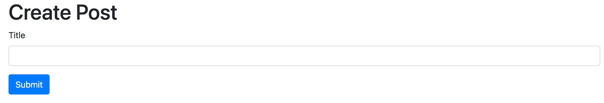
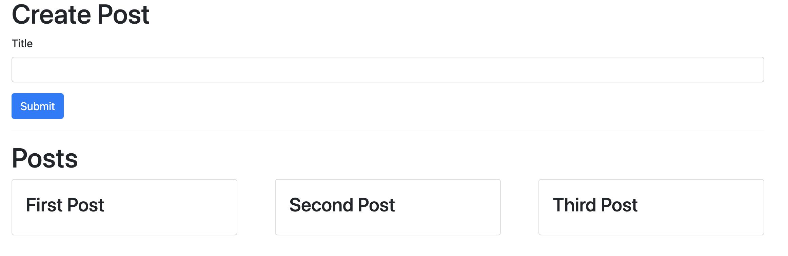

## Create first React component PostCreate

### Start implementing the client app:

1. Inside `client` folder, install `axios` to make request to Express apps.

```shell
npm install axios
```

2. Inside `src`, create `index.js` to render the main app inside `div` with `root` id:

```js
import React from "react";
import ReactDOM from "react-dom";
import App from "./App";

ReactDOM.render(<App />, document.getElementById("root"));
```

3. Then, create `app.js`:

```js
import React from "react";

const App = () => {
  return <div>Mini Blog App</div>;
};

export default App;
```

4. Start `client` app with:

```shell
npm start
```

### Create PostCreate component:

1. Create `PostCreate.js` to implement React component for post submission:

```js
import React from "react";

const PostCreate = () => {
  return (
    <div>
      <form>
        <div className="form-group">
          <label>Title</label>
          <input className="form-control" />
        </div>
        <button className="btn btn-primary">Submit</button>
      </form>
    </div>
  );
};

export default PostCreate;
```

2. Include `PostCreate` component inside `App` component:

```js
const App = () => {
  return (
    <div>
      <h1>Create Post</h1>
      <PostCreate />
    </div>
  );
};
```

### Hook up Bootstrap:

1. Find `BootstrapCDN` link to apply Bootstrap CSS, add to `public/index/html`"

```html
<link
  rel="stylesheet"
  href="https://cdn.jsdelivr.net/npm/bootstrap@4.4.1/dist/css/bootstrap.min.css"
  integrity="sha384-Vkoo8x4CGsO3+Hhxv8T/Q5PaXtkKtu6ug5TOeNV6gBiFeWPGFN9MuhOf23Q9Ifjh"
  crossorigin="anonymous"
/>
```

2. Add `container` classname to `App` component so that `App` does not use the whole screen:

```js
const App = () => {
  return (
    <div className="container">
      <h1>Create Post</h1>
      <PostCreate />
    </div>
  );
}"
```

### useState Hook and CORS errors:

1. Use `useState` hook inside `PostCreate` component to add some state, without the need to convert it to a class. Define an `onSubmit` function to be called whenever the form is submitted and prevent default action of browser trying to submit the form itself. Use `axios` to make POST requests to `posts` app and use async-await syntax.

```js
import React from "react";
import { useState } from "react";
import axios from "axios";

const PostCreate = () => {
  const [title, setTitle] = useState(""); //initialize it to empty string

  const onSubmit = async (e) => {
    e.preventDefault();

    await axios.post("http://localhost:4000/posts", {
      title,
    });

    setTitle("");
  };

  return (
    <div>
      <form onSubmit={onSubmit}>
        <div className="form-group">
          <label>Title</label>
          <input
            value={title}
            onChange={(e) => {
              setTitle(e.target.value);
            }}
            className="form-control"
          />
        </div>
        <button className="btn btn-primary">Submit</button>
      </form>
    </div>
  );
};

export default PostCreate;
```

2. Try submitting a post and handle the CORS error thrown automatically by browser after the attempt to make a request to the domain `localhost:4000` from a different domain `localhost:3000`. We have to set CORS headers in `posts` and `comments` apps. For both apps, first, install `cors` dependency:

```shell
npm install cors
```

Then, use `cors` middleware:

```js
const cors = require("cors");
const app = express();
app.use(cors());
```

3. Frontend app now should look like below and submit posts without CORS errors:



## Create the PostList component

1. Implement `PostList` functional component that makes GET requests to `posts` app and renders the posts in Bootstrap cards.

```js
import React from "react";
import { useState, useEffect } from "react";
import axios from "axios";

const PostList = () => {
  const [posts, setPosts] = useState({});

  const fetchPosts = async () => {
    const res = await axios.get("http://localhost:4000/posts");

    setPosts(res.data); //axios uses res.data
  };

  // empty array of variables to check before re-rendering, fetch posts only once
  useEffect(() => {
    fetchPosts();
  }, []);

  const renderedPosts = Object.values(posts).map((post) => {
    return (
      <div
        className="card"
        style={{ width: "30%", marginBottom: "20px" }}
        key={posts.id} // because we generate list of elements, react expects key property on each element
      >
        <div className="card-body">
          <h3>{post.title}</h3>
        </div>
      </div>
    );
  });

  return (
    <div className="d-flex flex-row flew-wrap justify-content-between">
      {renderedPosts}
    </div>
  );
};

export default PostList;
```

2. Posts are now rendered only with their titles like below:


