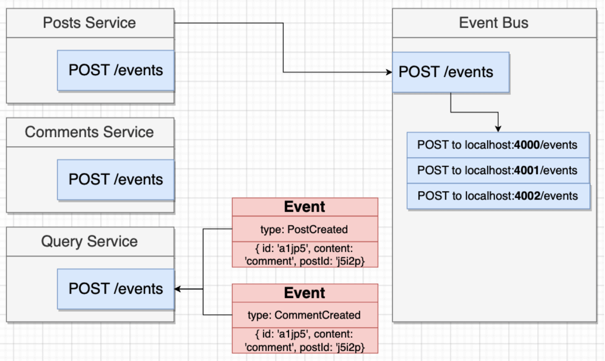
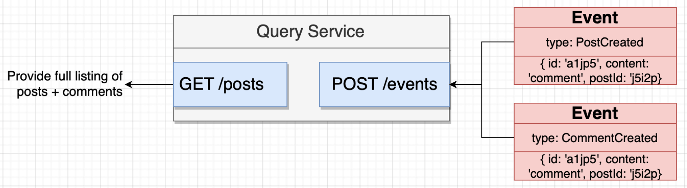

## Introducing Event Bus and CQRS Concepts

First, let's take a look at the current architecture. Currently, the frontend app makes one GET request to get the posts and one GET request **per** post to get the comments associated with that post, resulting in very inefficient communication between client and server.


One way to get all posts with all their associated comments is to possibly make a GET request such as `GET /posts?comments=true`, so that the `posts` app can call `comments` app to get all the associated comments and before returning the response. Advantages and disadvantages of this kind of **synchronous communication** are:

- :white_check_mark: Conceptually easy to understand.
- :x: Introduces a dependency between services.
- :x: If any inter-service request fails, the overall request from client fails.
- :x: The entire request is only as fast as the slowest request.
- :x: Can easily introduce a web of requests.

A better way to solve this issue is to use **asynchronous messaging** by means of introducing a helper app called `event bus` that acts a message broker between the apps...

<p align="center">

</p>

...and another app called `query` to serve only the read attempts from client, separating Command and Query purposes as advised by CQRS design pattern.

<p align="center">

</p>

Advantages and disadvantages of introducing CQRS are:

- :white_check_mark: Query service does not depend on other services.
- :white_check_mark: Query service will be fast.
- :x: Data duplication.
- :x: Relatively more complex.

### Implement a Simple Event Bus in Express

1. Create a separate app called `event-bus` just like `posts` and `comments` app. Catch errors in case promises are rejected, so that the failure of a service does not crash the `event-bus` broker, making each service to be more independent.

```js
const express = require("express");
const axios = require("axios");

const app = express();
app.use(express.json());

app.post("/events", (req, res) => {
  const event = req.body;

  console.log(event);

  axios.post("http://localhost:4000/events", event).catch((err) => {
    console.log(err);
  });
  axios.post("http://localhost:4001/events", event).catch((err) => {
    console.log(err);
  });
  axios.post("http://localhost:4002/events", event).catch((err) => {
    console.log(err);
  });

  res.send({ status: "OK" });
});

app.listen(4005, () => {
  console.log("Listening on 4005");
});
```

2. Whenever a post is created, emit a `PostCreated` event to the `event-bus` from `posts` service. Don't forget to add `async` keyword to callback function.

```js
await axios.post("http://localhost:4005/events", {
  type: "PostCreated",
  data: {
    id,
    title,
  },
});
```

3. Similary, emit a `CommentCreated` event with comment data from `comments` service.

```js
await axios.post("http://localhost:4005/events", {
  type: "CommentCreated",
  data: {
    id: commentId,
    content,
    postId: req.params.id,
  },
});
```

4. For now, simply print the event type in `posts` and `comments` services when an event is received.

````js
app.post("/events", (req, res) => {
  console.log("Received event", req.body.type);

  res.send({});
});```
````

### Implement Query Service

Implement `query` service to "persist" in memory both posts and associated comments in an object. Process `PostCreated` and `CommentCreated` events. Use `cors` so that the browser allows GET requests from `localhost:3000`.

```js
const express = require("express");
const cors = require("cors");

const app = express();
app.use(express.json());
app.use(cors());

const posts = {};

app.get("/posts", (req, res) => {
  res.send(posts);
});

app.post("/events", (req, res) => {
  const { type, data } = req.body;

  if (type === "PostCreated") {
    const { id, title } = data;

    posts[id] = {
      id,
      title,
      comments: [],
    };
  }

  if (type === "CommentCreated") {
    const { id, content, postId } = data;

    posts[postId].comments.push({ id, content });
  }

  res.send({});
});

app.listen(4002, () => {
  console.log("Listening on 4002");
});
```

### Modify React App to make requests to Query service for read purposes

1. In `PostList` component, make GET request to `query` service and pass comments itself as props to `CommentList` component, so that for read purposes only one request to back-end (to `query` service) is made.

```js
const fetchPosts = async () => {
  const res = await axios.get("http://localhost:4002/posts");

  setPosts(res.data);
};
```

2. Delete from `CommentList` component the requests to `comments` service, use props as comment content.

```js
import React from "react";

const CommentList = ({ comments }) => {
  // because we generate list of elements, react expects key property on each element
  const renderedComments = comments.map((comment) => {
    return <li key={comment.id}>{comment.content}</li>;
  });

  return <ul>{renderedComments}</ul>;
};

export default CommentList;
```

3. Now, even if `posts` and `comments` services crash, the created posts and comments can be served via `query` service to front-end. Another scenario is that the `comments` service can be down and new posts can be created through `posts` app and stored by `query` app. After that, if `posts` app crash and `comments` app starts running, new comments can be made through `comments` service to posts created by `posts` service when it was alive.
