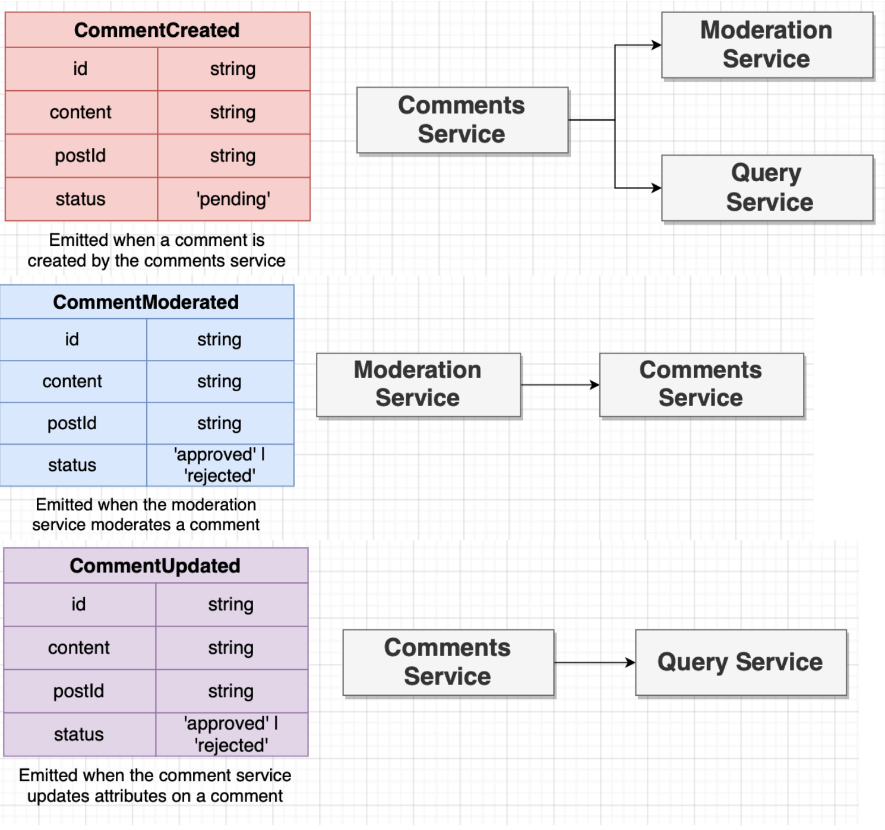
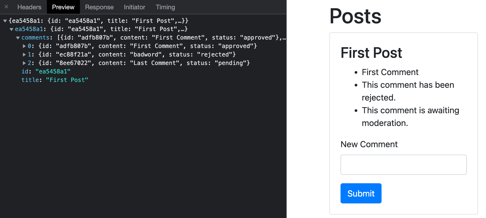

## Adding Comment Moderation Feature

1. Now, we will be implementing a new service `moderation` to approve or reject comments based on their content. For simplicity, the `moderation` service will approve comments unless they contain `badword` keyword. Types of events emmited from services related to moderation feature are:



2. Change `comments` service to add `pending` status when new comment is created by default. In `comments` service:

```js
comments.push({ id: commentId, content, status: "pending" });

commentsByPostId[req.params.id] = comments;

await axios
  .post("http://localhost:4005/events", {
    type: "CommentCreated",
    data: {
      id: commentId,
      content,
      postId: req.params.id,
      status: "pending",
    },
  })
  .catch((err) => {
    console.log(err);
  });
```

3.  Implement `moderation` service to run on port 4003 and to approve or reject comments based on the presence of `badword`.

```js
const express = require("express");
const axious = require("axios");

const app = express();
app.use(express.json());

app.post("/events", async (req, res) => {
  const { type, data } = req.body;

  if (type === "CommentCreated") {
    const status = data.content.includes("badword") ? "rejected" : "approved";

    await axious
      .post("http://localhost:4005/events", {
        type: "CommentModerated",
        data: {
          id: data.id,
          content: data.content,
          postId: data.postId,
          status,
        },
      })
      .catch((err) => {
        console.log(err);
      });
  }

  res.send();
});

app.listen(4003, () => {
  console.log("Listening on 4003");
});
```

3. Listen for `CommentModerated` event in `comments` service. Find the comment moderated and emit a `CommentUpdated` event.

```js
app.post("/events", async (req, res) => {
  const { type, data } = req.body;

  console.log("Received event", type);

  if (type === "CommentModerated") {
    const { postId, id, status, content } = data;

    const comment = commentsByPostId[postId].find((comment) => {
      return comment.id === id;
    });

    await axios
      .post("http://localhost:4005/events", {
        type: "CommentUpdated",
        data: {
          id,
          content,
          postId,
          status,
        },
      })
      .catch((err) => {
        console.log(err);
      });
  }

  res.send({});
});
```

4. Update `query` service to process `CommentUpdated` event.

````js
if (type === "CommentUpdated") {
    const { id, content, postId, status } = data;

    const comment = posts[postId].comments.find((comment) => {
      return id === comment.id;
    });

    comment.status = status;
    comment.content = content; // in case content update is implemented in the future
  }```
````

5. Change the React app to render comments or not depending on their `status`.

```js
import React from "react";

const CommentList = ({ comments }) => {
  // because we generate list of elements, react expects key property on each element
  const renderedComments = comments.map((comment) => {
    let content;

    if (comment.status === "approved") {
      content = comment.content;
    } else if (comment.status === "pending") {
      content = "This comment is awaiting moderation.";
    } else if (comment.status === "rejected") {
      content = "This comment has been rejected.";
    }

    return <li key={comment.id}>{content}</li>;
  });

  return <ul>{renderedComments}</ul>;
};

export default CommentList;
```

6. Now, even if the `moderation` service crashes, it is still possible to create comments although they are not displayed. To store comments to be moderated when `moderation` service runs again, we can use something similar to Event Source design pattern, which is explained in the next section.


