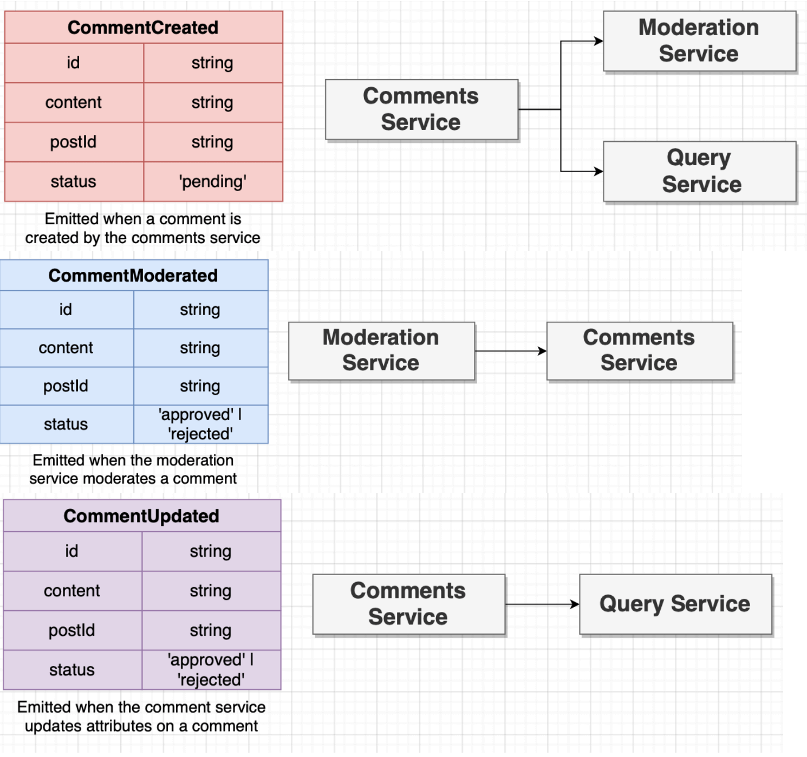
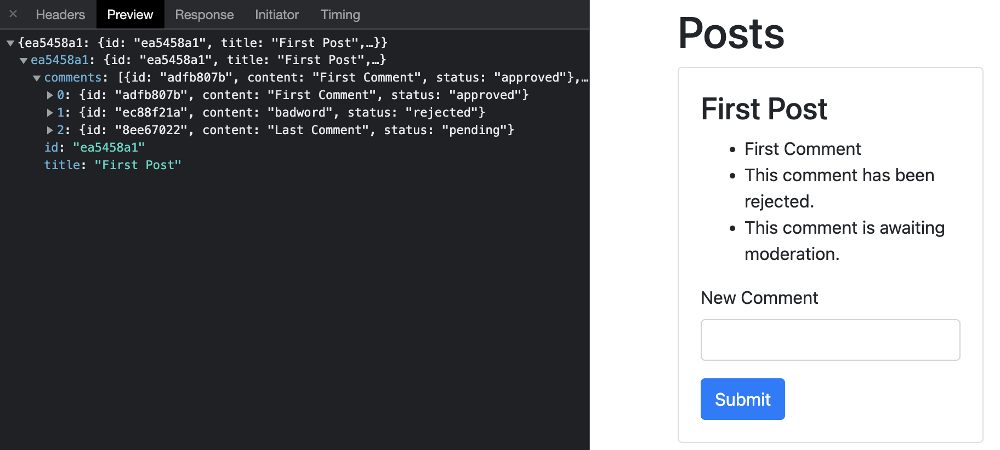
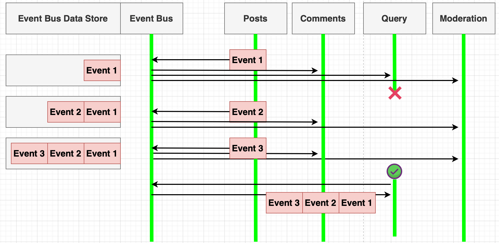

## Moderating comments in moderation service

1. Now, we will be implementing a new service `moderation` to approve or reject comments based on their content. For simplicity, the `moderation` service will approve comments unless they contain the keyword "badword". Types of events emmited from services related to moderation feature are:

<p align="center">

</p>

2. Change `comments` service to add `pending` status when new comment is created by default. In `comments` service:

```js
comments.push({ id: commentId, content, status: "pending" });

commentsByPostId[req.params.id] = comments;

await axios
  .post("http://localhost:4005/events", {
    type: "CommentCreated",
    data: {
      id: commentId,
      content,
      postId: req.params.id,
      status: "pending",
    },
  })
  .catch((err) => {
    console.log(err);
  });
```

3.  Implement `moderation` service to run on port 4003 and to approve or reject comments based on the presence of `badword`.

```js
const express = require("express");
const axious = require("axios");

const app = express();
app.use(express.json());

app.post("/events", async (req, res) => {
  const { type, data } = req.body;

  if (type === "CommentCreated") {
    const status = data.content.includes("badword") ? "rejected" : "approved";

    await axious
      .post("http://localhost:4005/events", {
        type: "CommentModerated",
        data: {
          id: data.id,
          content: data.content,
          postId: data.postId,
          status,
        },
      })
      .catch((err) => {
        console.log(err);
      });
  }

  res.send();
});

app.listen(4003, () => {
  console.log("Listening on 4003");
});
```

3. Listen for `CommentModerated` event in `comments` service. Find the comment moderated and emit a `CommentUpdated` event.

```js
app.post("/events", async (req, res) => {
  const { type, data } = req.body;

  console.log("Received event", type);

  if (type === "CommentModerated") {
    const { postId, id, status, content } = data;

    const comment = commentsByPostId[postId].find((comment) => {
      return comment.id === id;
    });

    await axios
      .post("http://localhost:4005/events", {
        type: "CommentUpdated",
        data: {
          id,
          content,
          postId,
          status,
        },
      })
      .catch((err) => {
        console.log(err);
      });
  }

  res.send({});
});
```

4. Update `query` service to process `CommentUpdated` event.

````js
if (type === "CommentUpdated") {
    const { id, content, postId, status } = data;

    const comment = posts[postId].comments.find((comment) => {
      return id === comment.id;
    });

    comment.status = status;
    comment.content = content; // in case content update is implemented in the future
  }```
````

5. Change the React app to render comments or not depending on their `status`.

```js
import React from "react";

const CommentList = ({ comments }) => {
  // because we generate list of elements, react expects key property on each element
  const renderedComments = comments.map((comment) => {
    let content;

    if (comment.status === "approved") {
      content = comment.content;
    } else if (comment.status === "pending") {
      content = "This comment is awaiting moderation.";
    } else if (comment.status === "rejected") {
      content = "This comment has been rejected.";
    }

    return <li key={comment.id}>{content}</li>;
  });

  return <ul>{renderedComments}</ul>;
};

export default CommentList;
```

6. Now, even if the `moderation` service crashes, it is still possible to create comments although they are not displayed.

<p align="center">

</p>

## Using event bus as an event source for query service

1. Next, we will make use of event sourcing pattern in the simplest form by storing all kinds of events in `event-bus` (that also acts like an event store for simplicity) and consuming them in `query` service, so that if the `query` restarts, the latest data can be shown to the frontend.

<p align="center">

</p>

2. Store `event`s in an array called `events` whenever an event is posted to the `event-bus` service...

```js
const events = [];

events.push(event); //inside post("/events") handler
```

...and implement a GET endpoint that returns `events`.

```js
app.get("/events", (req, res) => {
  res.send(events);
});
```

3. In the `query` service, move event processing into `handleEvent` function and make a GET request to `event-bus` to get all events when it starts running.

```js
app.listen(4002, async () => {
  console.log("Listening on 4002");

  const res = await axios
    .get("http://localhost:4005/events")
    .catch((err) => console.log(err));

  for (let event of res.data) {
    console.log("Processing event:" + event.type);

    handleEvent(event.type, event.data);
  }
});
```

4. Now, even after the `query` service crashes, new posts and (if available) comments can be created and displayed when the `query` service is up and running again.
