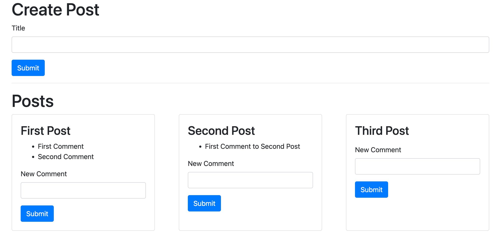

## Create the CommentCreate and CommentList components

### Create the CommentCreate component

1. `CommentCreate` component needs to know `post.id` to associate created comments with posts. To do this, pass along the `postId` prop from `PostList` component to `CommentCreate` component.

```js
<div className="card-body">
  <h3>{post.title}</h3>
  <CommentCreate postId={post.id} />
</div>
```

2. Then, take the `postId` prop input inside `CommentCreate` component and make POST requests to `comments` app, including comment `content` and `postId`.

```js
import React, { useState } from "react";
import axios from "axios";

/// use postId prop
const CommentCreate = ({ postId }) => {
  const [content, setContent] = useState("");

  const onSubmit = async (event) => {
    event.preventDefault();

    // pay attention to `backticks` when using props
    await axios.post(`http://localhost:4001/posts/${postId}/comments`, {
      content,
    });

    setContent("");
  };

  return (
    <div>
      <form onSubmit={onSubmit}>
        <div className="form-group">
          <label>New Comment</label>
          <input
            value={content}
            onChange={(e) => setContent(e.target.value)}
            className="form-control"
          />
        </div>
        <button className="btn btn-primary">Submit</button>
      </form>
    </div>
  );
};

export default CommentCreate;
```

### Create the CommentList component

1. Likewise, `CommentList` component needs `postId` prop, implement similary to make GET request to `comments` app:

```js
import React from "react";
import { useState, useEffect } from "react";
import axios from "axios";

const CommentList = ({ postId }) => {
  const [comments, setComments] = useState([]);

  const fetchComments = async () => {
    const res = await axios.get(
      `http://localhost:4001/posts/${postId}/comments`
    );

    setComments(res.data);
  };

  useEffect(() => {
    fetchComments();
  }, []);

  // because we generate list of elements, react expects key property on each element
  const renderedComments = comments.map((comment) => {
    return <li key={comment.id}>{comment.content}</li>;
  });

  return <ul>{renderedComments}</ul>;
};

export default CommentList;
```

2. Make sure you render the `CommentCreate` and `CommentList` components inside `PostList` component:

```js
<div className="card-body">
  <h3>{post.title}</h3>
  <CommentList postId={post.id} />
  <CommentCreate postId={post.id} />
</div>
```

3. Now, the frontend app should create and list comments like this:


