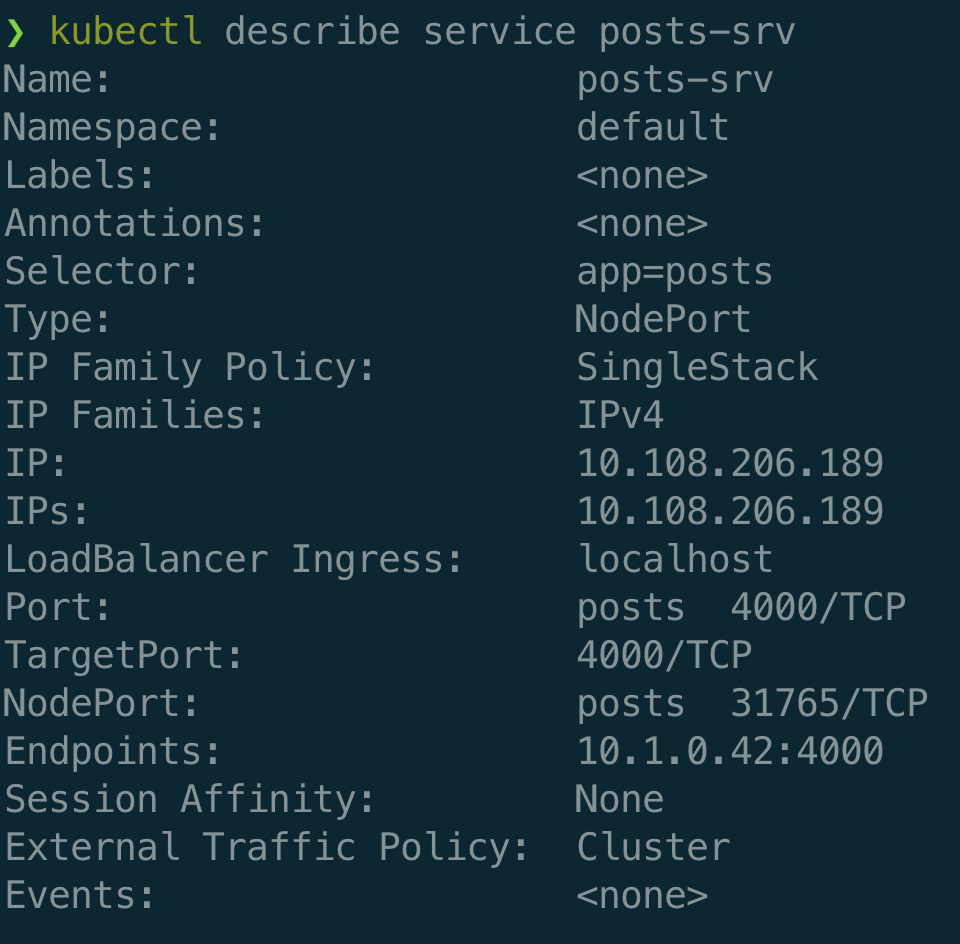

## Learning Kubernetes Terminology

- `K8s Cluster`: A collections of nodes + a master to manage them
- `Node`: A virtual machine that will run our containers
- `Pod`: _More or less_ a running container; technicall, a pod can run multiple containers but we won't do this
- `Deployment`: Monitors a set of pods, makes sure they are running and restarts them if they crash
- `Service`: Provides an easy-to-remember URL to access a running container

## Creating a Pod for Posts Service

1. Create K8s config .yaml file for the `posts` service.

```yaml
apiVersion: v1
kind: Pod
metadata:
  name: posts
spec:
  containers:
    - name: posts
      image: oesasdocker/posts:0.0.1
      imagePullPolicy: Never
```

2. Apply the config file in its folder by:

```shell
kubectl apply -f posts.yaml
```

3. Understanding a Pod Spec:

- `apiVersion: v1`: K8s is extensible. We can add in our own custom objects. This specifies the set of objects we want K8s to look at.
- `kind: Pod`: The type of K8s object we want to create.
- `metadata`: Metadata for the object to be created.
- `spec`: Exact attributes we want to apply to the object we are going to create.
- `name: posts`: Metadata for the container inside the pod.
- `image: oesasdocker/posts`: Image to instantiate.
- `imagePullPolicy: Never`: kubelet (primary node agent) does not try fetching the image.

### Learning Basic Kubectl Commands

For full Kubectl reference: [https://docs.docker.com/engine/reference/run/](https://docs.docker.com/engine/reference/run/).

1. Print out information about all running pods:

```shell
kubectl get pods
```

2. Execute the given command in a running pod, with stdin and tty:

```shell
kubectl exec -it POD -- CMD
```

3. Print out logs from a given pod:

```shell
kubectl logs POD
```

4. Delete a K8s object:

```shell
kubectl delete (FILENAME) | (TYPE NAME)
```

Delete a running pod:

```shell
kubectl delete pod NAME
```

5. Tell K8s to process the config:

```shell
kubectl apply -f FILENAME
```

6. Print out some info about running pod:

```shell
kubectl describe pod NAME
```

## Creating a Deployment

1. We will not be running pods on their own, instead use deployments to manage pods. In `posts-depl.yaml` file:

```yaml
apiVersion: apps/v1
kind: Deployment
metadata:
  name: posts-depl
spec:
  replicas: 1
  selector:
    matchLabels:
      app: posts
  template:
    metadata:
      labels:
        app: posts
    spec:
      containers:
        - name: posts
          image: oesasdocker/posts
```

2. Understanding the spec:

- `replicas`: number of pods we want to run
- `selector` tells deployment which pods to manage, ie, the pods in `template`
- `metadata` inside `template`: metadata for the pod

3. Similar commands for deployments:

```shell
kubectl apply -f FILE
kubectl get deployments
kubectl describe deployment NAME
kubectl delete deployment NAME
```

4. If you try to delete a pod inside a deployment, the deployment will create a new pod with from the same image.

## Updating Deployments with newer images

Manual and bad way:

1. Make a change to your project
2. Rebuild image, specify a new image version
3. In the deployment config file, update the version of the image
4. Run the command `kubectl apply -f FILE`

Preferred way through Docker Hub:

1. Do not specify version number in config file, it will assume latest tag
2. Make update to the code
3. Rebuild iamge
4. Push image to Docker Hub `kubectl push oesasdocker/posts`
5. Run the command `kubectl rollout restart deployment FILE`

## Networking with Services

1. Services provide networking between pods and from outside world to the pod.
2. Several types of services:

- `ClusterIP`: Sets up easy-to-remember URL to access a pod. Only exposes pods in the cluster.
- `Node Port`: Makes a pod accessible from outside the cluster. Usually only used for dev purposes.
- `Load Balancer`: Makes a pod accessible from outside the cluster. This is the right way to expose a pod to outside world.
- `External Name`: Redirects an in-cluster request to a CNAME url... Don't worry about this one for now.

3. To set up networking inside the cluster, we will be using ClusterIPs.

### Creating a Node Port service first

1. We will create config files to create services as well. In a file named `posts-srv.yaml`:

```yaml
apiVersion: v1
kind: Service
metadata:
  name: posts-srv
spec:
  type: NodePort
  selector:
    app: posts
  ports:
    - name: posts
      protocol: TCP
      port: 4000
      targetPort: 4000
```

2. Understanding NodePorts:

<p align="center">

</p>

- `selector`: Similar to the one in Deployment, tell Service which pod
- `name` under `ports`: name metadata of the port
- `port`: Port of NodePort service. The `NodePort` service will redirect traffic over to `targetPort` of the container.
- `targetPort`: Port of the pod, the one application uses inside the pod.

3. When you run `kubectl get services`:

<p align="center">

</p>

and run `kubectl describe service posts-srv`:

<p align="center">

</p>

- `NodePort`: randomly assigned port in 3xxxx to actually access the service, such as from the browser

4. `localhost:31765/posts` will make GET request to endpoint `/posts` of `posts` service.
