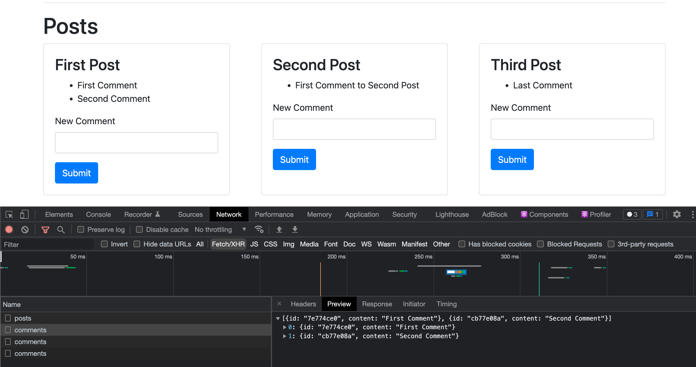
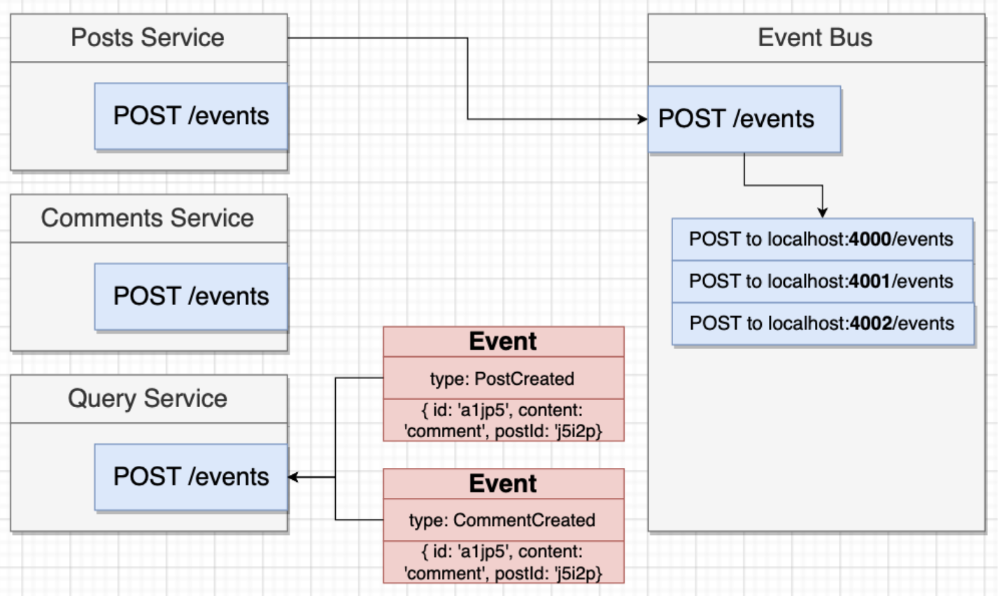
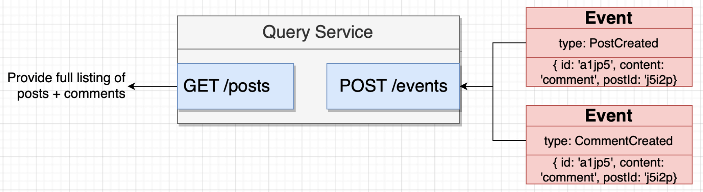

## Introducing Event Bus and CQRS concepts

First, let's take a look at the current architecture. Currently, the frontend app makes one GET request to get the posts and one GET request **per** post to get the comments associated with that post, resulting in very inefficient communication between client and server.



One way to get all posts with all their associated comments is to possibly make a GET request such as `GET /posts?comments=true`, so that the `posts` app can call `comments` app to get all the associated comments and before returning the response. Advantages and disadvantages of this kind of **synchronous communication** are:

- :white_check_mark: Conceptually easy to understand.
- :x: Introduces a dependency between services.
- :x: If any inter-service request fails, the overall request from client fails.
- :x: The entire request is only as fast as the slowest request.
- :x: Can easily introduce a web of requests.

A better way to solve this issue is to use **asynchronous messaging** by means of introducing a helper app called `event bus` that acts a message broker between the apps...

<p align="center">

</p>

...and another app called `query` to serve only the read attempts from client, separating Command and Query purposes as advised by CQRS design pattern.

<p align="center">

</p>

Advantages and disadvantages of introducing CQRS are:

- :white_check_mark: Query service does not depend on other services.
- :white_check_mark: Query service will be fast.
- :x: Data duplication.
- :x: Relatively more complex.

### Implement a simple event bus in Express

1. Create a separate app called `event-bus` just like `posts` and `comments` app.

```js
const express = require("express");
const bodyParser = require("body-parser");
const axios = require("axios");

const app = express();
app.use(bodyParser.json());

app.get("/events", (req, res) => {
  const event = req.body;

  axios.post("http://localhost:4000/events", event);
  axios.post("http://localhost:4001/events", event);
  axios.post("http://localhost:4002/events", event);

  res.send({ status: "OK" });
});

app.listen(4005, () => {
  console.log("Listening on 4005");
});
```

2. Whenever a post is created, emit a "PostCreated" event to the `event-bus` from `posts` service. Don't forget to add `async` keyword to callback function.

```js
await axios
  .post("http://localhost:4005/events", {
    type: "PostCreated",
    data: {
      id,
      title,
    },
  })
  .catch((err) => {
    console.log(err);
  });
```

3. Similary, emit a "CommentCreated" event with comment data from `comments` service.

```js
await axios
  .post("http://localhost:4005/events", {
    type: "CommentCreated",
    data: {
      id: commentId,
      content,
      postId: req.params.id,
    },
  })
  .catch((err) => {
    console.log(err);
  });
```
