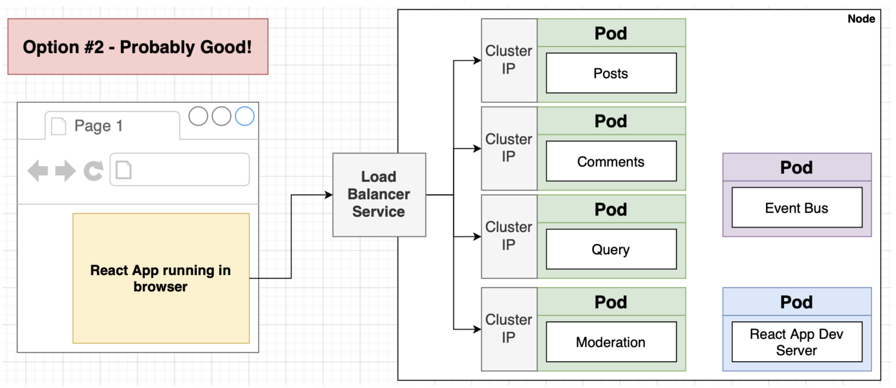
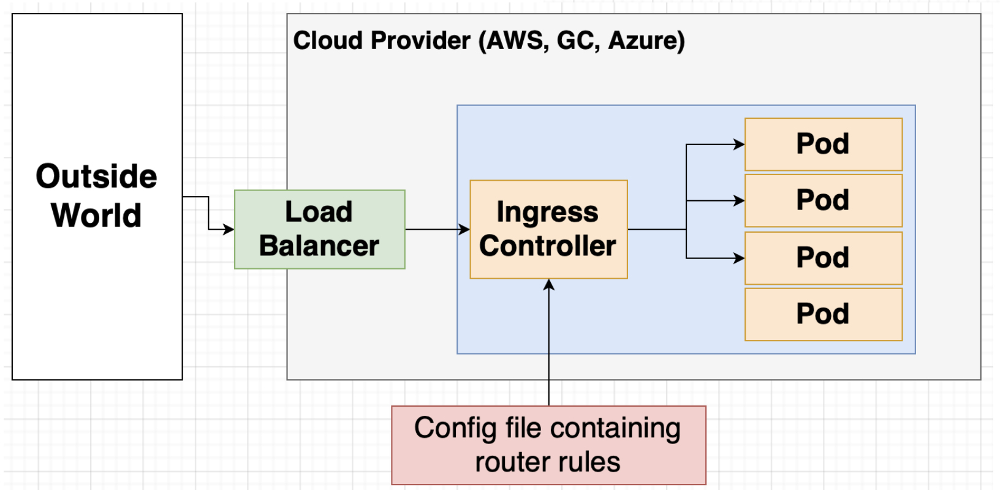
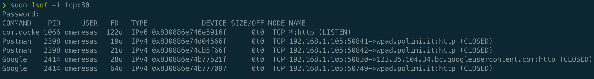
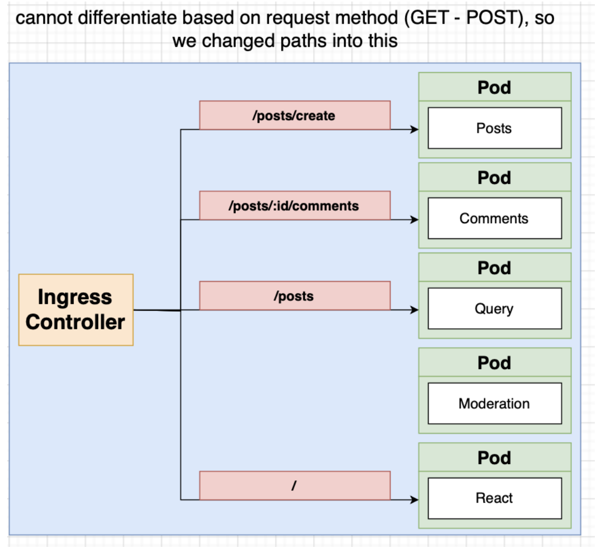

## Setting Up ClusterIP Services for Posts and Event Bus

1. Let's create a clusterIP service for the `event-bus` service, so that other services can send it events. In a file named `event-bus-depl.yaml`, we will specify both the deployment and the clusterIP for the `event-bus`. `type: ClusterIP` is optional, without this field it defaults to clusterIP as well.

```yaml
apiVersion: apps/v1
kind: Deployment
metadata:
  name: event-bus-depl
spec:
  replicas: 1
  selector:
    matchLabels:
      app: event-bus
  template:
    metadata:
      labels:
        app: event-bus
    spec:
      containers:
        - name: event-bus
          image: oesasdocker/event-bus
---
apiVersion: v1
kind: Service
metadata:
  name: event-bus-srv
spec:
  selector:
    app: event-bus
  type: ClusterIP
  ports:
    - name: event-bus
      protocol: TCP
      port: 4005
      targetPort: 4005
```

2. Create a clusterIP for the `posts` service too. Don't forget to apply config files.

```yaml
apiVersion: v1
kind: Service
metadata:
  name: posts-srv
spec:
  selector:
    app: posts
  ports:
    - name: posts
      protocol: TCP
      port: 4000
      targetPort: 4000
```

3. Update addresses of `posts` and `event-bus` to their clusterIPs inside the `posts` and `event-bus` code. For example, in `index.js` of posts:

````js
await axios
    .post("http://event-bus-srv:4005/events", {
      type: "PostCreated",
      data: {
        id,
        title,
      },
    })
    .catch((err) => {
      console.log(err);
    });
    ```
````

4. Re-build images of `posts` and `event-bus`, push to Docker Hub.
5. `rollout restart deployment` for both `posts-depl` and `event-bus-depl`, so that they run the latest images with clusterIP addresses.
6. Verify communication using Postman. Make sure you also run a `nodePort` for `posts` service for testing purposes.

- Learn actual `nodePort` by `kubectl get services`.
- Make a POST request to `localhost:30232/posts` to verify nodePort service.
- Run `kubectl get pods` and `kubectl logs posts-depl-67bf9ff9fb-7f5kd` to see logs of `posts` service. You should see "Received event PostCreated" which is sent by event bus.

### Adding ClusterIP Service for Other Services

1. Update the URLs of HTTP requests in services.

2. Re-build docker images and push to Docker Hub.

3. Create a deployment and clusterIP for `moderation`, `query` and `comments` services as well.

4. Run `kubectl apply -f infra/k8s/.` to apply all created config files.

5. Update URLs in `event-bus`, re-build image, push to Docker Hub, and `kubectl rollout restart deployment event-bus-srv`.

## Installing Ingress Nginx

1. How do we call services from the client? Either we can use a NodePort for each of the posts, comments and query services, or we can make use of load balancer service.

<p align="center">

</p>

2. There are two different services when it comes to load balancers in K8s:

- `Load Balancer Service`: Tells Kubernetes to reach out to its provider and provision a load balancer. Gets traffic to a _single pod_.

- `Ingress or Ingress Controller`: A pod with a set of routing rules to distribute traffic to (clusterIP services of) other services. (Technically `ingress` and `ingress controller` are two different things, but can be used interchangebly for now.)

<p align="center">

</p>

3. Install Ingress-Nginx: Ingress-Nginx (the one in [https://github.com/kubernetes/ingress-nginx](https://github.com/kubernetes/ingress-nginx)) creates a Load Balancer service and an Ingress automatically. Note: Kubernetes-ingress is totally different (see [https://www.nginx.com/blog/guide-to-choosing-ingress-controller-part-4-nginx-ingress-controller-options/](https://www.nginx.com/blog/guide-to-choosing-ingress-controller-part-4-nginx-ingress-controller-options/)).

Install ingress-nginx with `kubectl apply -f https://raw.githubusercontent.com/kubernetes/ingress-nginx/controller-v1.1.2/deploy/static/provider/cloud/deploy.yaml`.

2. Create routing rules in `ingress-srv.yaml`. Ingress will scan applied config files and try to find annotations, specifically the one we specified, to get the routing rules.

```yaml
apiVersion: networking.k8s.io/v1
kind: Ingress
metadata:
  name: ingress-srv
  annotations:
    kubernetes.io/ingress.class: nginx
spec:
  rules:
    - host: posts.com
      http:
        paths:
          - path: /posts
            pathType: Prefix
            backend:
              service:
                name: posts-srv
                port:
                  number: 4000
```

Ingress nginx is assuming we might be running many different apps at different domains in one cluster. So we associate rules with apps hosted at particular domains.

3. To make a request from our browser to `posts-srv`, try accessing `posts.com/posts` from browser. However, instead of trying to find `posts.com` online, we need to trick our machine into thinking that `posts.com` is in fact hosted in our local machine. To do this, run `code /etc/hosts` and add line `127.0.0.1 posts.com`.

4. If you are unable to access the application you may have something already running on port 80, which is the default port for the ingress. Run `sudo lsof -i tcp:80` to see which processes use port 80. If Docker is properly listening on port 80 you should see something very similar:

<p align="center">

</p>

If something else is listed for `TCP *:http`, you'll need to shut that service down.

## Integrating React App into the Cluster

1. Inside React components, change requests from `localhost:port` to `posts.com`. The OS will take requests to `posts.com` and find its host as `localhost` and port 80, where the ingress will be listening and routing requests to clusterIP services based on paths of requests.

2. Add two lines to Dockerfile of `client` to prevent some React-related bug in Docker containers, and push to Docker Hub:

```Dockerfile
FROM node:16-alpine

# to prevent React related bug
ENV CI=true
ENV WDS_SOCKET_PORT=0

WORKDIR /app
COPY package.json ./
RUN npm install --legacy-peer-deps
COPY ./ ./

CMD ["npm", "start"]
```

3. Create a `client-depl.yaml` to serve HTML, CSS and JS from inside the pod, and apply it:

```yaml
apiVersion: apps/v1
kind: Deployment
metadata:
  name: client-depl
spec:
  replicas: 1
  selector:
    matchLabels:
      app: client
  template:
    metadata:
      labels:
        app: client
    spec:
      containers:
        - name: client
          image: oesasdocker/client
---
apiVersion: v1
kind: Service
metadata:
  name: client-srv
spec:
  selector:
    app: client
  ports:
    - name: client
      protocol: TCP
      port: 3000
      targetPort: 3000
```

4. Bad news: ingress cannot differentiate request based on methods. So, modify routes to be unique like so:

<p align="center">

</p>

Update routes in React app `client` and the `posts` service, re-build images, push to Docker Hub, and rollout restart deployments.

5. Update paths in `ingress-srv.yaml`. Ingress does not make use of wildcars with columns (:) in paths, so use wildcars with regex (the one below is any value followed by `/comments`). Add annotation to use regex. Finally, add `/` path with wildcard **at the end** to make it work with SPA approach (not used here but in general for other apps). Path rules are **ordered from greatest priority to lowest** from top to bottom.

```yaml
apiVersion: networking.k8s.io/v1
kind: Ingress
metadata:
  name: ingress-srv
  annotations:
    kubernetes.io/ingress.class: nginx
    nginx.ingress.kubernetes.io/use-regex: "true"
spec:
  rules:
    - host: posts.com
      http:
        paths:
          - path: /posts/create
            pathType: Prefix
            backend:
              service:
                name: posts-srv
                port:
                  number: 4000
          - path: /posts
            pathType: Prefix
            backend:
              service:
                name: query-srv
                port:
                  number: 4002
          - path: /posts/?(.*)/comments
            pathType: Prefix
            backend:
              service:
                name: comments-srv
                port:
                  number: 4001
          - path: /?(.*)
            pathType: Prefix
            backend:
              service:
                name: client-srv
                port:
                  number: 3000
```

6. At this point, you should reach `posts.com` and use the app just like before.
