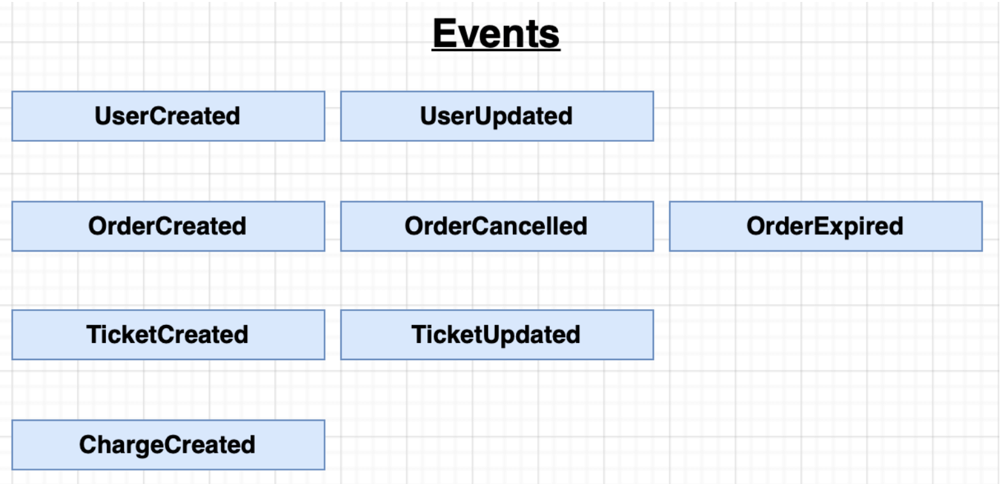

## Business Rules of the Ticketing App

The ticketing app will be similar to "stubhub" app. Some of the capabilites we are going to implement for the ticketing app are:

- Users can list a ticket for an event (sport, theatre etc) for sale.
- Other users can purchase this ticket.
- Any user can list tickets and purchase tickets.
- When a user attempts to purchase a ticket, the ticket is "locked" for 15 minutes. The user has 15 minutes to enter the payment info.
- While locked, no other user can purchase this ticket, it won't be even displayed for sale. After 15 minutes, the ticket should "unlock".
- Ticket prices can be edited if not locked. What if the seller tries to edit the price while another user tries to lock the ticket? This little item will introduce some concurreny issues...

The ticketing app will utilize real databases, production-grade event bus and commonly used payment APIs.

### Data Models

### Services of Ticketing App

### Types of Events

### Architecture

