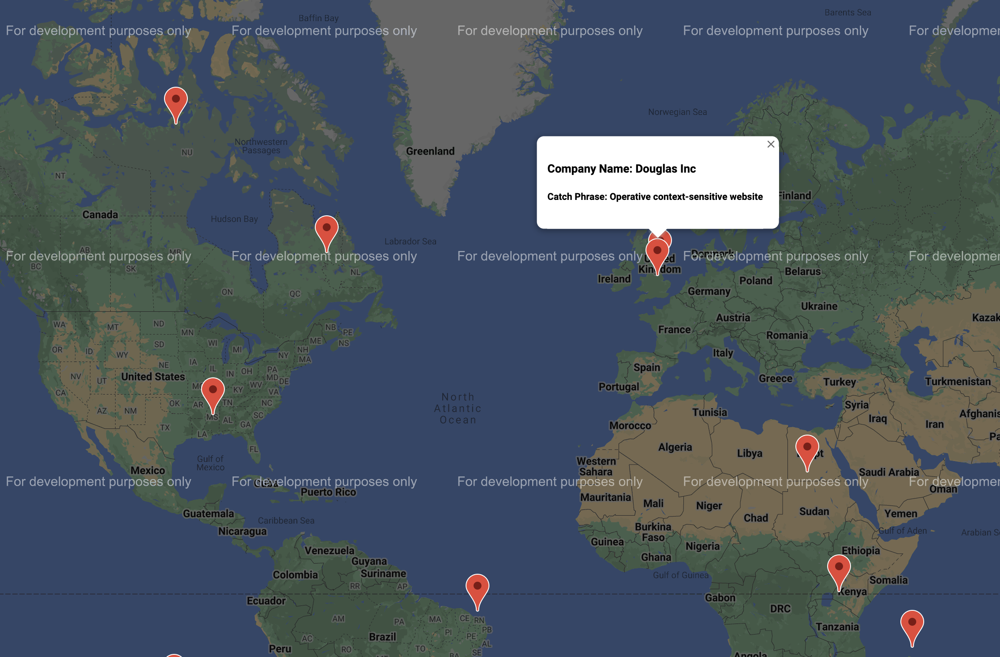

## TypeScript Crash Course

- In short, TypeScript = JavaScript + type system

  - Helps us catch errors **during** development
  - Uses **type annotations** to analyze code
  - Only active during development
  - Compiles to JS, does not provide any performance enhancement

- To install TypeScript: `npm install -g typescript ts-node`. `ts-node` is a CLI tool to compile and execute TypeScript with one command, technically, TypeScript execution engine and REPL for Node.js

Instead of...

```shell
tsc index.ts
node index.js
```

...you can do

```shell
ts-node index.ts
```

- Use Prettier Code Formatter (personal preferences):

  - Run on save
  - 2 spaces for indentation
  - Double quotes

- Very Basic Type Annotation Example:

```ts
import axios from "axios";

const url = "https://jsonplaceholder.typicode.com/todos/1";

// interface from OOP
interface ToDo {
  id: number;
  title: string;
  completed: boolean;
}

axios.get(url).then((response) => {
  const todo = response.data as ToDo;

  console.log(response.data);

  const id = todo.id;
  const title = todo.title;
  const completed = todo.completed;

  logToDo(id, title, completed);
});

// signature of function, attributes and order can be checked
const logToDo = (id: number, title: string, completed: boolean) => {
  console.log(`
    The ToDo with ID: ${id},
    Has a title of: ${title},
    Is it finished?: ${completed}
  `);
};
```

- **Type annotations**: Code we add to tell TS what type of value a variable will refer to.

```ts
// Some type annotations

let apples: number = 5;
let speed: string = "fast";
let hasName: boolean = true;

let nothingMuch: null = null;
let nothing: undefined = undefined;

// built-in objects
let now: Date = new Date();

// arrays
let colors: string[] = ["red", "green", "blue"];

// multi-type arrays
let colorsOrNumbers: (string | number)[] = ["red", 15, "blue"];

// classes
class Car {}
let car: Car = new Car();

// object literals
let point: { x: number; y: string } = {
  x: 10,
  y: "foo",
};

// functions: Type inference works on function return value but not on type of arguments.
// It is better to be on the safe side and specify return type too.

const add = (a: number, b: number): number => {
  return a + b;
};

// functions that returns void can return null or undefined without error
function logger(logstring: string): void {
  console.log(logstring);
}

const multiply = function (a: number, b: number): number {
  return a * b;
};

// when we never expect the function to complete
const throwError = (message: string): never => {
  throw new Error(message);
};

// if we expect it to return some value
const mayThrowError = (message: string): string => {
  if (!message) {
    throw new Error(message);
  }

  return message;
};
```

- **Type inference**: TS tries to figure out what type of value a variable refers to.

```ts
// When does the type inference work?

// When declaration and initialization is done at the same time
let apples = 5; // apples will be of type "number"

let oranges; // oranges will be of type "any"
oranges = 10;
```

- When to use annotations?

```ts
// 1) Functions that return the "any" type
const json = '{"x": 10, "y": 20}';
const coordinates: { x: number; y: number } = JSON.parse(json);

// coordinates.z gives error

// 2) Declare a variable and initialize later
let words = ["red", "green", "blue"];
let foundWord: boolean;

for (let i = 0; i < words.length; i++) {
  if (words[i] === "red") {
    foundWord = true;
  }
}

// 3) Variables whose types cannot be inferred correctly
let numbers = [-10, -2, 15];
let numberAboveZero: boolean | number = false;

for (let i = 0; i < numbers.length; i++) {
  if (numbers[i] > 0) {
    numberAboveZero = numbers[i];
  }
}
```

- Destructuring with TS:

```ts
// object destructuring with TS
const todaysWeather = {
  date: new Date(),
  weather: "sunny",
};

// first method without destructuring
const firstLogWeather = (forecast: { date: Date; weather: string }) => {
  console.log(forecast.date);
  console.log(forecast.weather);
};

// second method with TS similar to ES2015
// list different properties you want to pull out of the object like normal destructuring
// then add the annotations
const secondLogWeather = ({
  date,
  weather,
}: {
  date: Date;
  weather: string;
}) => {
  console.log(date);
  console.log(weather);
};

secondLogWeather(todaysWeather);
```

- Annotations around objects:

```ts
const profile = {
  name: "alex",
  age: 20,
  coords: {
    lat: 0,
    lng: 15,
  },
  setAge(age: number): void {
    this.age = age;
  },
};

// we need to mirror the object structure, simply ":number" won't work
const { age }: { age: number } = profile;

const {
  coords: { lat, lng },
}: { coords: { lat: number; lng: number } } = profile;
```

- Tuples are available but not so helpful since the properties do not have names:

```ts
// instead of object literal like
const drink = {
  color: "brown",
  carbonated: true,
  sugar: 40,
};

const coffee: [string, boolean, number] = ["black", false, 0];

// Type alias for tuples
type Drink = [string, boolean, number];

const tea: Drink = ["brown", false, 10];
```

- Interface concept from OOP:

```ts
interface Reportable {
  summary(): string;
}

const newCivic = {
  name: "civic",
  production: new Date(),
  broken: false,
  summary(): string {
    return `Name: ${this.name}`;
  },
};

const coke = {
  sugar: 100,
  calorie: 500,
  summary(): string {
    return `Calorie: ${this.calorie}`;
  },
};

const printSummary = (item: Reportable): void => {
  console.log(item.summary());
};

printSummary(newCivic);
printSummary(coke);
```

- Method modifiers in classes:

  - `public` methods can be called any where, any time.
  - `private` methods can only be called by _other methods_ in _this class_.
  - `protected` methods can be called by other methods in _this_ class, or by other methods in _child classes_.

- A shortcut using constructor in classes:

```ts
class Vehicle {
  constructor(public color: string, private price: number) {}
}

const car = new Vehicle("red", 2500);
```

- Inheritance:

```ts
class Vehicle {
  constructor(public color: string, private price: number) {}
}

const car = new Vehicle("red", 2500);

class Car extends Vehicle {
  constructor(color: string, price: number, public wheels: number) {
    super(color, price);
  }
}

const batMobile = new Car("black", 10000, 8);
```

## A Mini-Map TS App with Google Maps API

In this simple app, we will show randomly generated users and companies with markers on a map interface that uses Google Maps SDK. Mainly, we will have three classes `User`, `Company` and `Map`.

1. Install and use `parcel` to convert TS to JS and feed it into `index.html`.

```shell
npm install --save-dev parcel
```

Then create `index.html`, add script tag with source `src/index.ts` and run:

```shell
npx parcel index.html
```

2. Use `faker.js` to generate realistic fake data. For v6+ of `faker` you don't need to add type definition files `@types/faker` manually, there is native support for TS. You can look into type definition files such as `faker.d.ts` to see full API.

```shell
npm install @faker-js/faker --save-dev
```

3. The `User` class can simply have a name and a latitude and longitute to mark it on a map, all of which are randomly generated by `faker.js`:

```ts
import { faker } from "@faker-js/faker";

export default class User {
  name: string;
  location: {
    lat: number;
    lng: number;
  };

  constructor() {
    this.name = faker.name.firstName();
    this.location = {
      lat: parseFloat(faker.address.latitude()),
      lng: parseFloat(faker.address.longitude()),
    };
  }
}
```

4. The `Company` class can additionally have a catch phrase:

```ts
import { faker } from "@faker-js/faker";

export default class Company {
  name: string;
  catchPhrase: string;
  location: {
    lat: number;
    lng: number;
  };

  constructor() {
    this.name = faker.company.companyName();
    this.catchPhrase = faker.company.catchPhrase();
    this.location = {
      lat: parseFloat(faker.address.latitude()),
      lng: parseFloat(faker.address.longitude()),
    };
  }
}
```

5. To use Google Maps SDK, we will need an API key with Google Maps feature enabled. Create a new project on Google Console and enable "Maps Javascript API". Then generate a new API key under credentials. Add `script` with `src` attribute like below:

```html
<html>
  <body>
    <script src="https://maps.googleapis.com/maps/api/js?key=YOUR-KEY-HERE"></script>
    <script type="module" src="./src/index.ts"></script>
  </body>
</html>
```

Also install the type definition file for Google Maps JS:

```shell
npm i --save-dev @types/google.maps
```

To verify that it works, check the console in the browser and look for a network request similar to the one we specified. You can also check for a global variable named `google`, which means it is available everywhere inside our project without import statements.

6. Take a look into the `index.d.ts` type definition file for Google Maps JS, do a <kbd>cmd</kbd> + <kbd>shift</kbd> + <kbd>P</kbd> and do fold level 2 to condense some section of code. This can help you find interesting things inside the library and learn method signatures, classes, available options and alike.

7. To create a map, instantiate a `Map` object and provide it with an `HTMLElement`.

```ts
const map = new google.maps.Map(document.getElementById("map"), {
  zoom: 1,
  center: {
    lat: 0,
    lng: 0,
  },
});
```

In `index.html` file:

```html
<html>
  <body>
    <div id="map" style="height: 100%"></div>
    <script src="https://maps.googleapis.com/maps/api/js?key=YOUR-KEY-HERE"></script>
    <script type="module" src="./src/index.ts"></script>
  </body>
</html>
```

8. See how you add a marker from `index.d.ts` and add a `Mappable` interface for `User`, `Company` or any other item to implement.

```ts
export default class Map {
  private map: google.maps.Map;
  private infowindow = new google.maps.InfoWindow();

  constructor(elementID: string) {
    this.map = new google.maps.Map(document.getElementById(elementID), {
      center: {
        lat: 0,
        lng: 0,
      },
      zoom: 1,
    });
  }

  addMarker(item: Mappable) {
    const marker = new google.maps.Marker({
      map: this.map,
      position: {
        lat: item.location.lat,
        lng: item.location.lng,
      },
    });

    marker.addListener("click", () => {
      this.infowindow.setContent(item.markerContent());
      this.infowindow.open({
        anchor: marker,
        map: this.map,
        shouldFocus: false,
      });
    });
  }
}

export interface Mappable {
  location: {
    lat: number;
    lng: number;
  };
  markerContent(): string;
}
```

9. Implement `Mappable` interface in `User` and `Company` and finish the app. In `index.ts`:

```ts
import User from "./User";
import Company from "./Company";
import Map from "./Map";

const map = new Map("map");

for (let i = 0; i < 10; i++) {
  map.addMarker(new User());
  map.addMarker(new Company());
}
```

10. Make sure parcel serves `index.html` in `localhost:1234`. The mini-map app now have pop-up windows and looks like:

<p>

</p>
