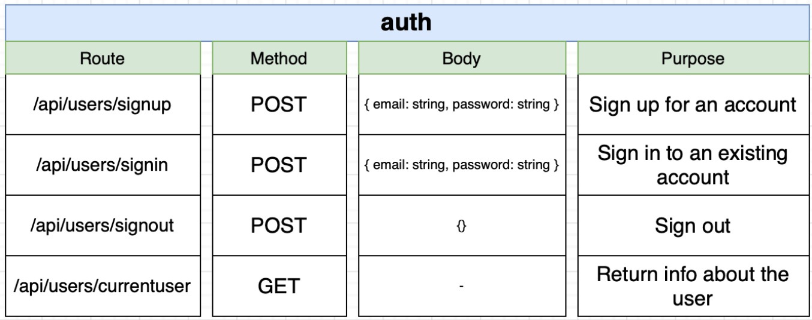
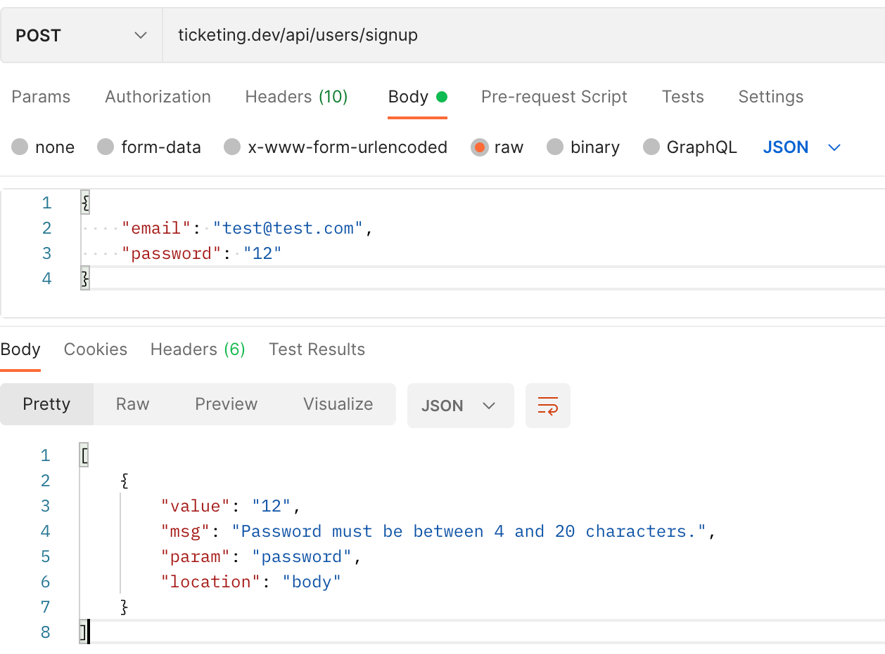

## Skaffolding Auth Service

1. The endpoints of our authorization service will be:

<p>

</p>

2. Init auth service, add below dependencies and init tsconfig.json:

```shell
npm i typescript ts-node-dev express @types/express
tsc --init
```

3. Implement basic TS express app, dockerize it, create K8s deployment and ClusterIP service, add Skaffold to the project. Instantiate the project by `skaffold dev`. Try syncing between the dev machine and the pod by changing the `index.ts` code. If the newer version is not thrown into the pod and the server does not start, try updating the start script:

```shell
ts-node-dev --poll src/index.ts
```

4. Create and fill in ingress-nginx config file `ingress-srv.yaml` just like we did for the mini-blog app. We didn't delete ingress-nginx from our cluster, we should not have to reinstall it. In case you removed it from the cluster, apply `ingress-nginx-file.yaml` or follow the latest installation instructions from its website.

```yaml
apiVersion: networking.k8s.io/v1
kind: Ingress
metadata:
  name: ingress-srv
  annotations:
    kubernetes.io/ingress.class: nginx
    nginx.ingress.kubernetes.io/use-regex: "true"
spec:
  rules:
    - host: ticketing.dev
      http:
        paths:
          - path: /api/users/?(.*)
            pathType: Prefix
            backend:
              service:
                name: auth-srv
                port:
                  number: 3000
```

Don't forget to tweak host file, specifically, add `ticketing.dev` to `/etc/hosts` to point to `127.0.0.1`.

5. Implement the GET `api/users/currentuser` endpoint to return a simple response and try accessing `ticketing.dev/api/users/currentuser`. If you can't reach the server and see a warning such as "Your connection is not private.", it is a warning from the browser about self-sign certificates. Ingress-nginx is a web server that uses HTTPS connections and by default it uses self-signed certificates. Browsers in general does not trust websites that use self-signed certificates. Type "thisisunsafe" to by-pass the warning.

## Sign Up Route, Validation and Error Handling

1. Create 4 routers in 4 files inside `src/routes`. The one for `/api/users/currentuser` might for now look like:

```ts
import express from "express";

const router = express.Router();

router.get("/api/users/currentuser", (req, res) => {
  res.send("Hi there");
});

export { router as CurrentUserRouter };
```

2. Import it inside `index.ts` and use it like:

```ts
import express from "express";
import { CurrentUserRouter } from "./routes/current-user";

const app = express();

app.use(express.json());

app.use(CurrentUserRouter);

app.listen(3000, () => {
  console.log("Listening on 3000");
});
```

Do the same for other 3 routers. Don't forget to change HTTP methods accordingly.

3. Start implementing `SignUpRouter`. Use `express-validator` to validate email and password as middleware functions. Also make use of `validationResult` from the same library to read the properties attached to the `req` object in case validation result is negative.

```ts
router.post(
  "/api/users/signup",
  [
    body("email").isEmail().withMessage("Email must be valid."),
    body("password")
      .trim()
      .isLength({ min: 4, max: 20 })
      .withMessage("Password must be between 4 and 20 characters."),
  ],
  (req: Request, res: Response) => {
    const errors = validationResult(req);

    if (!errors.isEmpty()) {
      return res.status(400).send(errors.array());
    }

    const { email, password } = req.body;

    console.log("Creating user");

    res.send({});
  }
);
```

4. Try the Sign Up route on Postman. Expect errors to be in the JSON form like below:

<p>

</p>

However, different services can return errors in different JSON or XML structures, so we need some kind of "error structure normalization".

<p>

</p>

For this feature, we will be implementing an error handler middleware. Before our custom error handler, check out first the error handling in express: [https://expressjs.com/en/guide/error-handling.html](https://expressjs.com/en/guide/error-handling.html). **You will have to call `next` function for errors that are thrown inside async functions, see bottom of page**

5. Create `src/middlewares/error-handler.ts`. Create and export a function with four arguments, as simple as the one in below. Use this middleware in the app in `index.ts` **after other middlewares**.

```ts
import { Request, Response, NextFunction } from "express";

export const errorHandler = (
  err: Error,
  req: Request,
  res: Response,
  next: NextFunction
) => {
  console.log("Something went wrong");

  res.status(400).send({
    message: err.message,
  });
};
```

Now, whenever an error occurs, `throw new Error('some message')`.

6. In order to feed info about the error to error handler, we can subclass the built-in `Error` class and add the properties we wish depending on the context. Create `request-validation-error.ts` and `db-connection-error.ts` in `src/errors`. They may look like:

```ts
import { ValidationError } from "express-validator";

export class RequestValidationError extends Error {
  constructor(public errors: ValidationError[]) {
    super();

    Object.setPrototypeOf(this, RequestValidationError.prototype);
  }
}
```

Now throw different types of errors and type-check in error handler.

7. We will use a common response structure from any service to the frontend as an object that has a `errors` property:

<p>

</p>

Format errors into the common structure above, in `error-handler.ts`:

```ts
if (err instanceof RequestValidationError) {
  const formattedErrors = err.errors.map((error) => {
    return {
      message: error.msg,
      field: error.param,
    };
  });

  return res.status(400).send({ errors: formattedErrors });
}

if (err instanceof DbConnnectionError) {
  return res.status(500).send({
    errors: [
      {
        message: err.reason,
      },
    ],
  });
}
```

8. One thing that is not so good about the error handler is that, it needs to know how to extract information from each specific kind of error. To improve this issue, we can make use of abstract custom error class. In `custom-error.ts`:

```ts
export abstract class CustomError extends Error {
  abstract statusCode: number;

  constructor(message: string) {
    super(message); //for logging purposes
    Object.setPrototypeOf(this, CustomError.prototype);
  }

  abstract serializeErrors(): {
    message: string;
    field?: string;
  }[];
}
```

Then, move error formatting logic inside `serializeErrors` function of `RequestValidationError` and `DbConnectionError`, which implements `CustomError` abstract class. Change type-checking inside `error-handler.ts` into below and add a default error handling logic.

```ts
export const errorHandler = (
  err: Error,
  req: Request,
  res: Response,
  next: NextFunction
) => {
  if (err instanceof CustomError) {
    return res.status(err.statusCode).send({ errors: err.serializeErrors() });
  }

  res.status(400).send({
    errors: [
      {
        message: "Something went wrong",
      },
    ],
  });
};
```

10. Finally, add a new custom error `NotFoundError` by extending `CustomError`. **After all the auth routing middleware but before the error handler middleware**, throw the `NotFoundError` in case the requested route is not implemented. You don't need to add its handler now since it is a subclass of `CustomError`.

```ts
app.all("*", () => {
  throw new NotFoundError();
});
```

11. To handle errors thrown inside async functions or call-backs, you either need to call the `next` function, or stick with `throw` keyword and as we will demonstrate now, use `express-async-errors` that makes `express` wait on asycn functions and watch for errors thrown inside these functions.

```ts
import "express-async-errors";

...

app.all("*", async () => {
  throw new NotFoundError();
});

```
