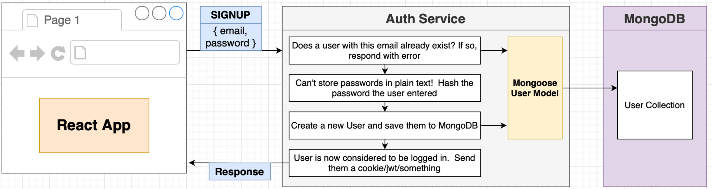
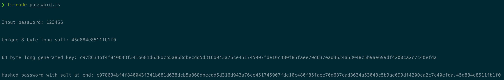

## Database Management and Modeling for Auth Service

For persistence tasks of the `auth` service, we will be using:

- `MongoDB`: Document-oriented NoSQL database
- `Mongoose`: Node.js-based Object Data Modeling (ODM) library for MongoDB.

For more information on Mongoose: [https://mongoosejs.com/docs/index.html](https://mongoosejs.com/docs/index.html)

Note that for now the data in MongoDB will be gone when we stop its pod. Later on we will make use of Docker volumes to actually persist the data in MongoDB.

### MongoDB Instance Setup

1. Create a K8s deployment and ClusterIP service inside `auth-mongo-depl.yaml` in `infra/k8s` folder, use `mongo` image from Docker Hub. Note that MongoDB server in the image listens on the standard MongoDB port 27017.

2. Install as dependency and import mongoose inside `index.ts`. Use async-await syntax to connect to Mongo instance. Because we are running Mongo inside a pod and not on a local machine, we need to connect to its ClusterIP service. Finally, add `auth` at the end of connection string to create a database named `auth`.

```ts
const start = async () => {
  try {
    await mongoose.connect("mongodb://auth-mongo-srv:27017/auth");
  } catch (err) {
    console.error(err);
  }

  console.log("Connected to MongoDB");

  app.listen(3000, () => {
    console.log("Listening on 3000");
  });
};

start();
```

### User Mongoose Model

1. Create `models/user.ts`, specify Schema, compile it to a Model that we use to interact with database and try creating a new user.

```ts
import mongoose from "mongoose";

const userSchema = new mongoose.Schema({
  email: {
    type: String,
    required: true,
  },
  password: {
    type: String,
    required: true,
  },
});

const User = mongoose.model("User", userSchema);

const someUser = new User({
  email: "test@test.com",
  pass: 1234, // Typo and type mismatch did not result in TS errors!
});

export { User };
```

2. Because TS has no idea about the correct structure we use to create a `User` document, it does not catch the above error. To fix this, we will specify attributes of `User` as an interface for TS and use our own constructor kind-of function to create a `User` document.

```ts
interface userAttrs {
  email: string;
  password: string;
}

const buildUser = (userAttrs: userAttrs) => {
  return new User(userAttrs);
};

export { User, buildUser }; // Is there a more intuitive way instead of exporting both?
```

3. Attach `buildUser` function as a static function of `User` model, so that it can be called like `User.build()`.

```ts
userSchema.statics.build = (attrs: userAttrs) => {
  return new User(attrs);
};

export { User };
```

4. Try calling `User.build()`. TS gives an error because it doesn't know about the presence of a `build` method of `User`, which is a standard `mongoose.Model<any, {}, {}, {}>`. To fix this, we will create an interface that reflects the properties of `User`, so that `User` implements it and TS learns about `User`'s methods.

```ts
// an interface that describes the properties a User Model has
interface UserModel extends mongoose.Model<any> {
  build(attrs: userAttrs): any;
}

const User = mongoose.model<any, UserModel>("User", userSchema);

// now we can create new users by
User.build({ email: "test@test.com", password: "password" });
```

5. Lastly, we create an interface for a single user, aka, a `User` document, so that we can access its attributes without TS giving errors. Add `UserDoc` interface to `UserModel` interface so that created users will be a `UserDoc`, i.e., a type that we know for sure that implements `UserDoc` interface.

```ts
// an interface that describes the properties a User document has
interface UserDoc extends mongoose.Document {
  email: string;
  password: string;
}

// an interface that describes the properties a User Model has
interface UserModel extends mongoose.Model<UserDoc> {
  build(attrs: userAttrs): UserDoc;
}

const User = mongoose.model<UserDoc, UserModel>("User", userSchema);

const someUser = User.build({ email: "test@test.com", password: "password" });

// now we can access attributes
console.log(someUser.email);
```

## Sign Up Flow

In short, sign up flow will look like:

<p>

</p>

### Creating a New User

1. As a first step, simply check if the email is already in use, otherwise, create a new user.

```ts
const { email, password } = req.body;

const existingUser = await User.findOne({ email });

if (existingUser) {
  console.log("Email in use");
  return res.send({});
}

const user = User.build({ email: email, password: password });
await user.save();

return res.status(201).send(user);
```

2. Create `bad-request-error.ts`, subclass `CustomError` abstract class and throw a `BadRequestError` whenever the email is in use. Feed it a message about context since it might be used in different scenarios. Try registering a user on Postman with an email in use and notice that it follows the same error structure we discussed for other errors.

```ts
if (existingUser) {
  throw new BadRequestError("Email in use");
}
```

3. **Under no circumstances, do not store passwords as plain texts**. Instead, use **hashing** techniques for passwords, for more info: [https://www.authgear.com/post/password-hashing-salting](https://www.authgear.com/post/password-hashing-salting)

Create `password.ts` under `src/services`.

```ts
import { scrypt, randomBytes } from "crypto";
import { promisify } from "util";

// to use promises instead of callbacks when calling scrypt
const asyncScrypt = promisify(scrypt);

export class Password {
  static async toHash(password: string) {
    const salt = randomBytes(8).toString("hex");
    const buf = (await asyncScrypt(password, salt, 64)) as Buffer;

    return `${buf.toString("hex")}.${salt}`;
  }

  // compare hashed passwords during sign in
  static async compare(storedPassword: string, suppliedPassword: string) {
    const [hashedPassword, salt] = storedPassword.split(".");

    const buf = (await asyncScrypt(suppliedPassword, salt, 64)) as Buffer;

    return buf.toString("hex") === hashedPassword;
  }
}
```

The example output (with logs) of static `toHash` function might look like:

<p>

</p>

4. Use **Mongoose Pre-Save hook** to replace the plain password with the hashed one when a user is first created or its password is modified. Inside `user.ts` after `userSchema` is created:

```ts
userSchema.pre("save", async function (done) {
  // "this" refers to the document that is being saved

  // will be true when "this" is created for the first time or password attribute is modified
  if (this.isModified("password")) {
    const hashedPassword = await Password.toHash(this.get("password"));
    this.set("password", hashedPassword);
    done(); // we need to call the given call-back function after calling Schema.pre()
  }
});
```

5. Create a new user by Postman and see the password attribute having the hashed password value. **Note that sending back plain or hashed password is only for development purposes.**
