## Authentication Strategies

- There are various ways to do user authentication in a microservices application.

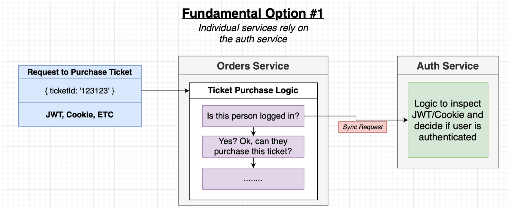

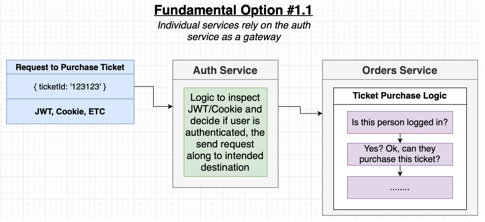

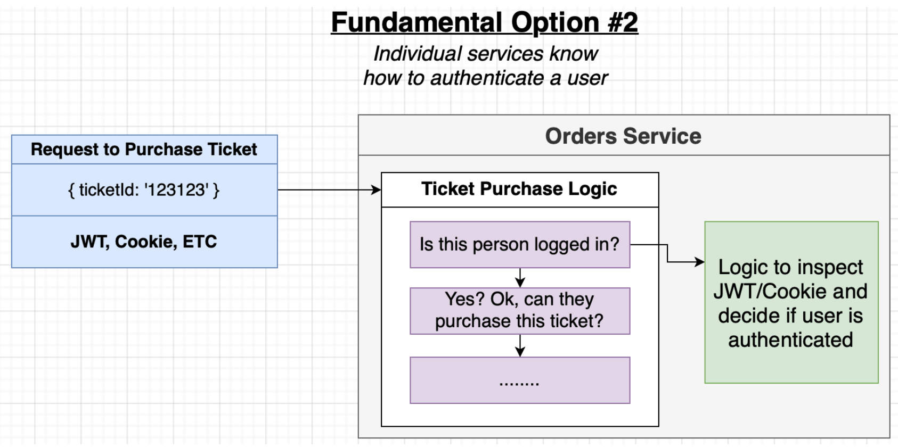

- We will go with **fundemental option 2**, which results in **more independent services** but with **duplicated logic**, **possibly shared via an npm module** about to do token-related tasks.

## Need for Token Lifetime

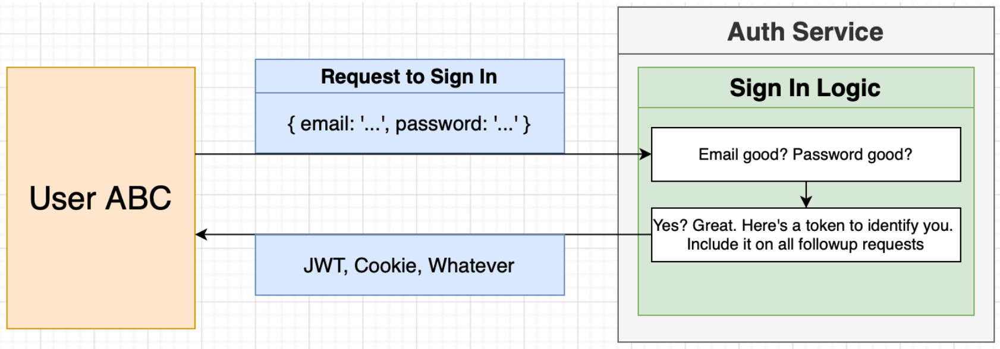

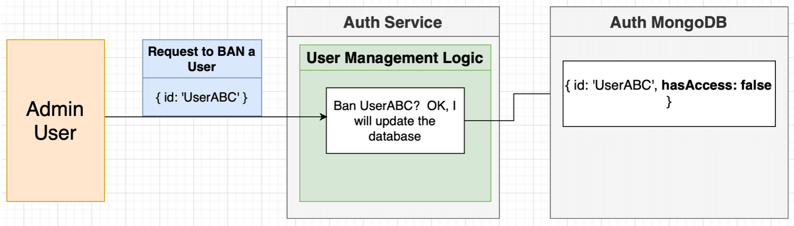

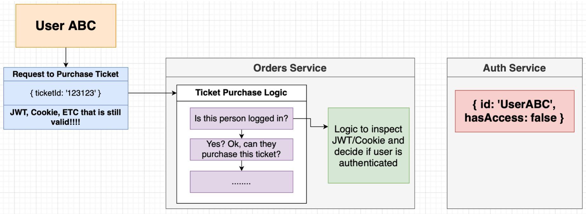

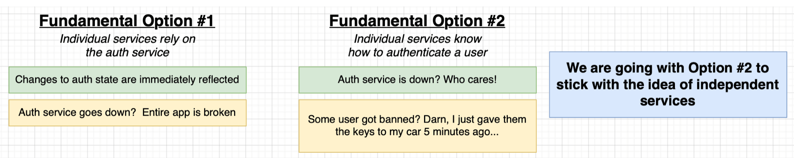

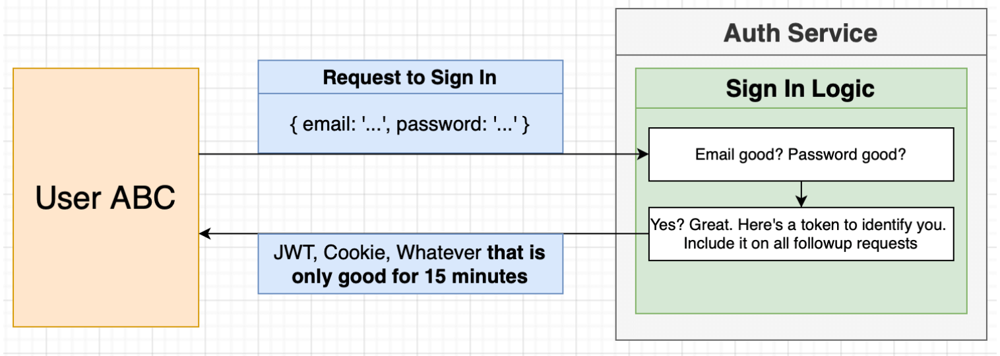

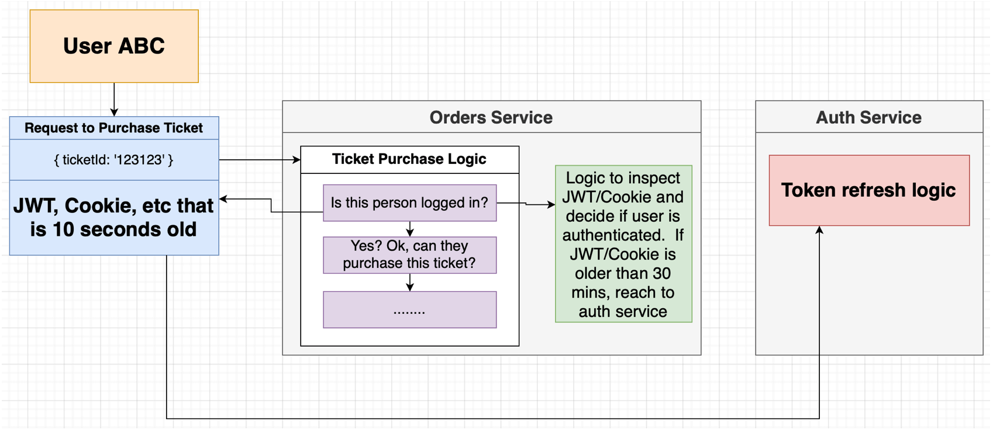

- In case the security requirements are more strict, for example, banned users with valid tokens being able to make requests in a window of time until their tokens expire, we can make use of events and store the list of banned users in cache of services for a limited amount of time, which should be equal to the lifetime of a token.

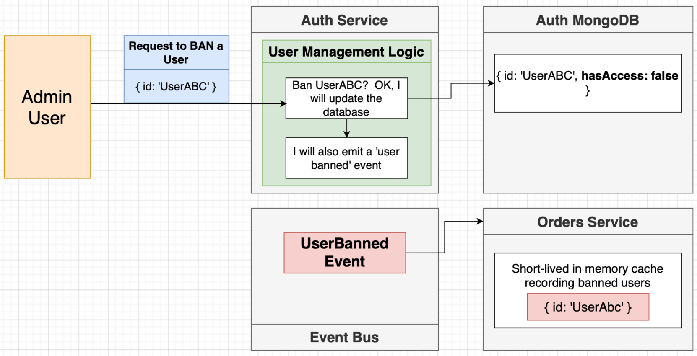

## Reminder on Cookies and JWT

Cookies:

- Transport mechanism.
- Moves any kind of data between browser and server.
- Automatically managed by the browser.

JSON Web Tokens:

- Authentication/authorization mechanism.
- Stores any data we want.
- We have to manage it manually.

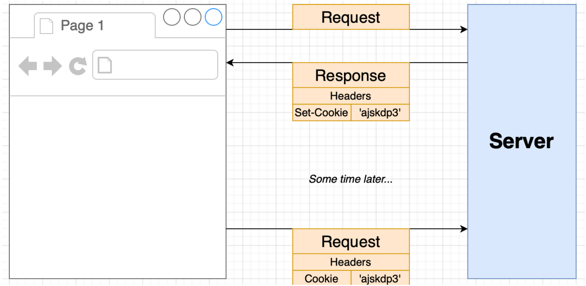

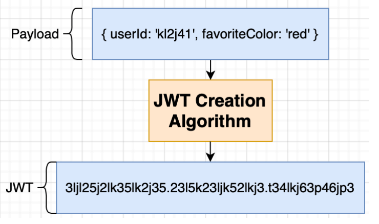

## Requirements for Our Auth Mechanism

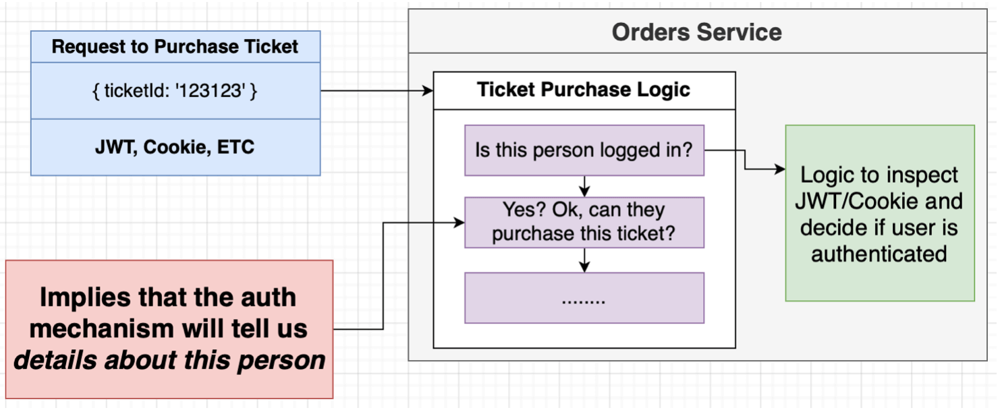

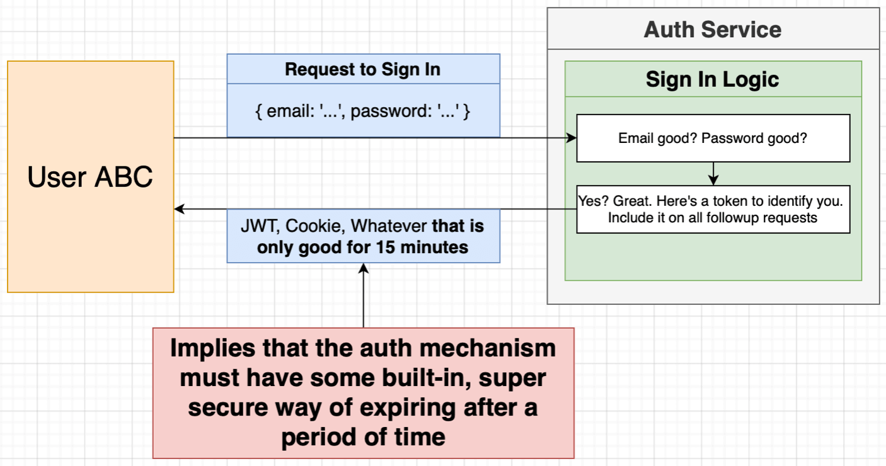

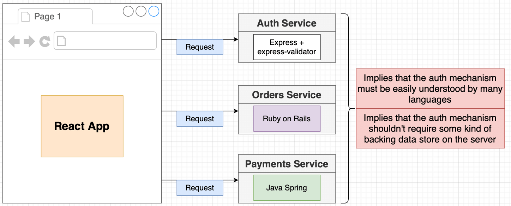

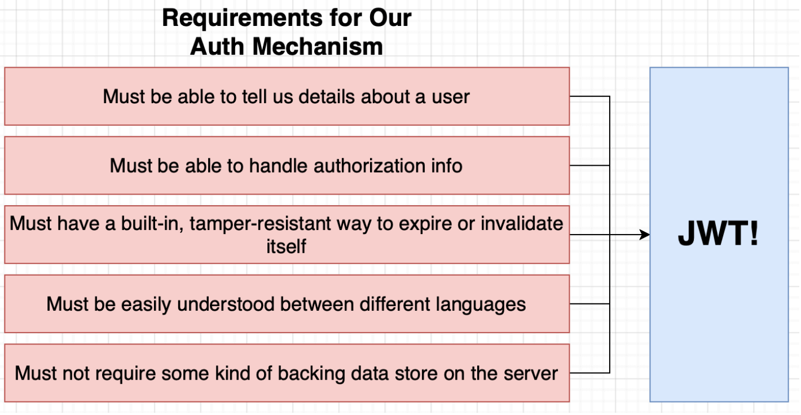

## Server-Side-Rendering and Sending Tokens over to Server

- In a normal React app, the client does not have to send the custom JWT inside the very first request to the server.

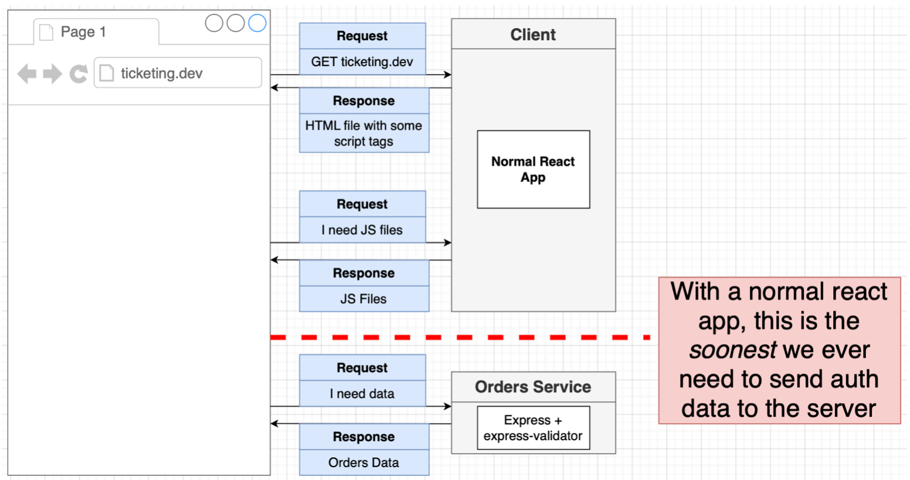

- However, with SSR, the server needs the auth data in the very first request, which cannot be customised like the above case after some ordinary requests and responses.

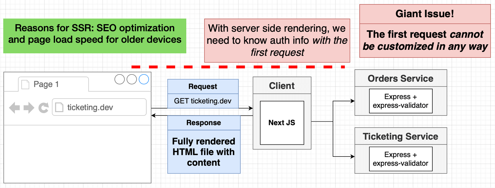

- **Storing JWTs inside the cookies** is the (almost) only way to communicate info in the first request to the server when using SSR. We can also use **service workers** but it is much more complicated.

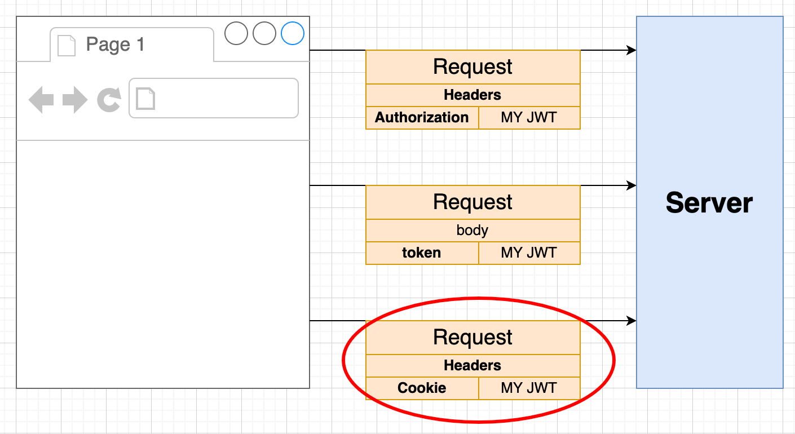

## Encryption of Cookie Contents

- Cookie handling across programming languages (in a typical microservices app) is usually an issue when we encrypt the data in the cookie.
- Even though we will be using Node.js for our services, for simplicity, **we will not encrypt the cookie contents**.
- **JWTs are tamper resistant**, in other words, users will be able to read the cookie contents (JWTs), but if they try to modify the content of the JWT, it will be invalid immediately.
- Although in general this is not a big concern, you can still encrypt the cookie contents if it is a big deal for you, for example, if you are going to store protected information in a JWT, which you should **not** be doing.
