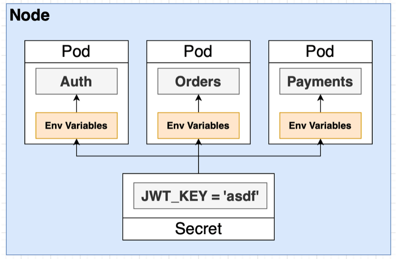

## Using Cookie Session and Generating JWTs

1. Inside `auth` folder, install `cookie-session` and its type definitions for TS:

```shell
npm install cookie-session @types/cookie-session
```

2. Inside `index.ts` import it and use as a middleware after `express.json()`. Note that the traffic to `auth` service is proxied by `ingress-nginx`. Express will see the fact that there is a proxy and does not trust HTTPS connections through proxies. So we make Express trust traffic as being secure even though it is coming from that proxy.

```ts
app.set("trust proxy", true); // to make Express trust HTTPS connections from proxies
app.use(express.json());
app.use(
  cookieSession({
    signed: false, // to disable encryption of cookies
    secure: true, // to allow cookies only from HTTPS conneciton
  })
);
```

3. Install `jsonwebtoken` and its type definition file:

```shell
npm install jsonwebtoken @types/jsonwebtoken
```

In `signup.ts`, after saving the new user to Mongo, generate a JWT by providing the **payload** and the **secret (signing key)** , which we will discuss later on in more detail. Then, store it on the `req.session` object by specifying the object structure from stratch because of TS.

```ts
const user = User.build({ email: email, password: password });
await user.save();

// generate JWT
const userJwt = jwt.sign(
  {
    id: user.id,
    email: user.email,
  },
  "secret"
);

// store it on session object
req.session = {
  jwt: userJwt,
};

return res.status(201).send(user);
```

4. Try signing up a user by Postman and see the generated cookie inside the response. Don't forget to make the POST request **via HTTPS.**

<p>

</p>

Decode the JWT from Base64 string format into UTF-8 string format.

<p>

</p>

Then, go to [jwt.io](https://jwt.io/) to verify the signature by **first entering the secret and then entering the token**. The other way around re-creates signature of the token based on the entered secret. For more info: [https://stackoverflow.com/questions/69862105/jwt-io-says-signature-verified-even-when-key-is-not-provided](https://stackoverflow.com/questions/69862105/jwt-io-says-signature-verified-even-when-key-is-not-provided)

<p>

</p>

## Storing Keys as Kubernetes Secrets

1. To be able to decode JWT tokens in all services, the services need the signing key.

<p>

</p>

Intead of hardcoding keys in source code, we will make use of Kubernetes `secret`s.
Kubernetes secrets are Kubernetes objects that we can use to store multiple key-value pairs. We will **store the signing key in a Kubernetes secret** we will create and **provide it to services as environment variables**.

<p>

</p>

To create a Kubernetes secret in an **imperative** way and store `jwt=ticketingsecret` key-value pair, as opposed to the **declarative** approach through .yaml files:

```shell
kubectl create secret generic jwt-secret --from-literal=JWT_KEY=ticketingsecret
```

The reason we opt for imperative approach is that we don't want any config files storing the value of the secret. A more professional way is that storing the value of the secret as an environment variable in local machine and referring to it in a config file. **For dev purposes, take a note of that secret and store it in a secure location, you can search online on how to do it**. You can do a `kubectl get secrets` to see them.

Inside `infra/k8s/auth-depl.yaml`, to create an environment value and specify its value from a key-value pair inside secret:

```yaml
spec:
  containers:
    - name: auth
      image: oesasdocker/auth
      env:
        - name: JWT_KEY # how it shows up inside container
          valueFrom:
            secretKeyRef:
              name: jwt-secret
              key: JWT_KEY # there can be many keys inside a secret
```

2. To access the signing key as `JWT_KEY` environment variable instead of hardcoding it as plain text, modify the jwt creation section:

```ts
// generate JWT
const userJwt = jwt.sign(
  {
    id: user.id,
    email: user.email,
  },
  process.env.JWT_KEY // TS will give a type error
);
```

To solve the type error, we can verify the presence of `process.env.JWT_KEY` for TS before attemting to use it. **Instead of verifying the presence inside a route, we should do that at the very start of auth app, just before connecting to MongoDB**

```ts
const start = async () => {
  if (!process.env.JWT_KEY) {
    throw new Error("JWT_KEY must be defined");
  }

  try {
    await mongoose.connect("mongodb://auth-mongo-srv:27017/auth");
  } catch (err) {
    console.error(err);
  }

  console.log("Connected to MongoDB");

  app.listen(3000, () => {
    console.log("Listening on 3000");
  });
};

start();
```

Now, because the verification is done in another file, TS still complains about the type-mismatch. Hence, we will use the **exclamation mark !** to tell TS that we already checked it and that it doesn't need to not worry about it. It is a way to tell the compiler "this expression cannot be `null` or `undefined` here, so don't complain about the possibility of it being `null` or `undefined`."

```ts
// generate JWT
const userJwt = jwt.sign(
  {
    id: user.id,
    email: user.email,
  },
  process.env.JWT_KEY!
);
```

3. Finally, sign up a new user via Postman, decode the paylod and verify the signature on [jwt.io](https://jwt.io/).
