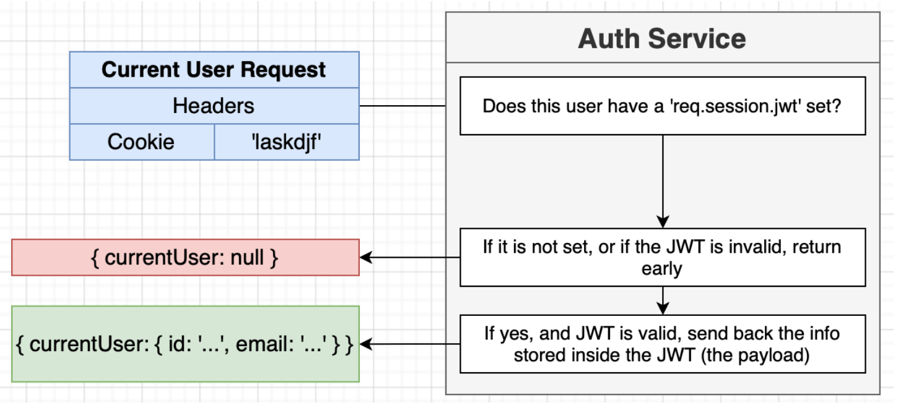
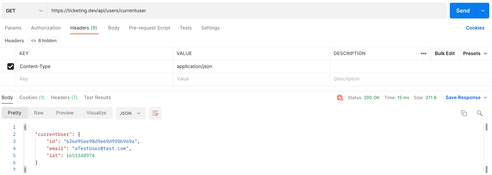
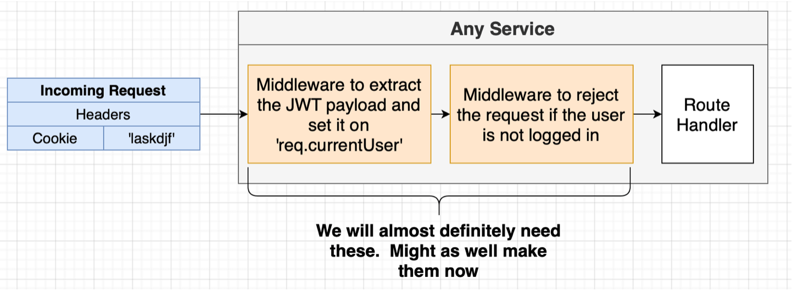

## Abstracting Request Validation into a Middleware

1. Abstract request validation login into `services/request-validator.ts`:

```ts
import { Request, Response, NextFunction } from "express";
import { validationResult } from "express-validator";
import { RequestValidationError } from "../errors/request-validation-error";

export const validateRequest = (
  req: Request,
  res: Response,
  next: NextFunction
) => {
  const errors = validationResult(req);

  if (!errors.isEmpty()) {
    throw new RequestValidationError(errors.array());
  }

  next();
};
```

2. Then, you can use the `validateRequest` middleware in `signup.ts` and `signin.ts`.

```ts
router.post(
  "/api/users/signin",
  [
    body("email").isEmail().withMessage("Email must be valid."),
    body("password")
      .trim()
      .notEmpty()
      .withMessage("Password must be supplied."),
  ],
  validateRequest,
  (req: Request, res: Response) => {}
);
```

## Implementing Sign In Logic

1. Check for existing user, give away as little information as possible if the credentials are not valid, for example, do not tell "Email not found". Then, check passwords and also create a JWT and store it inside a cookie. Because a resource is not created, set 200 OK status instead of a 201.

```ts
const router = express.Router();

router.post(
  "/api/users/signin",
  [
    body("email").isEmail().withMessage("Email must be valid."),
    body("password")
      .trim()
      .notEmpty()
      .withMessage("Password must be supplied."),
  ],
  validateRequest,
  async (req: Request, res: Response) => {
    const { email, password } = req.body;

    const existingUser = await User.findOne({ email });

    if (!existingUser) {
      throw new BadRequestError("Invalid credentials.");
    }

    const passwordMatch = await PasswordManager.compare(
      existingUser.password,
      password
    );

    if (!passwordMatch) {
      throw new BadRequestError("Invalid credentials.");
    }

    const userJwt = jwt.sign(
      {
        id: existingUser.id,
        email: existingUser.email,
      },
      process.env.JWT_KEY!
    );

    req.session = {
      jwt: userJwt,
    };

    return res.status(200).send(existingUser);
  }
);

export { router as SignInRouter };
```

2. Try signing up a new user, then try signing in with good and bad credentials.

## Getting Current User Info

We add a current user auth logic so that React app can make requests and figure out whether the current user is logged in. **If they are already logged in, in other words, have valid JWT, we will send back the payload of the JWT**.

<p>

</p>

1. Check whether `req.session.jwt` is defined, if not, it means it doesn't have any kind of JWT inside a cookie. If so, return early. Inside `routes/current-user.ts`:

```ts
import express from "express";
import jwt from "jsonwebtoken";
const router = express.Router();

router.get("/api/users/currentuser", (req, res) => {
  if (!req.session?.jwt) {
    // eqv to (!req.session || !req.session.jwt)
    return res.send({ currentUser: null });
  }
});

export { router as CurrentUserRouter };
```

2. Then, verify whether the JWT inside cookie is valid, by using `jwt.verify()`. Provide it with the signing key. If the token has been messed with, the `jwt.verify()` will throw an error. So use a try-catch block, and send the payload (object with `id` and `email` properties) if the token is verified.

```ts
try {
  const payload = jwt.verify(req.session.jwt, process.env.JWT_KEY!);
  res.send({ currentUser: payload });
} catch (err) {
  return res.send({ currentUser: null });
}
```

3. After you sign up or sign in a user, make a GET request to `https://ticketing.dev/api/users/currentuser`. You do not need to set the cookie, as Postman automatically saves cookies and adds them if they are set as a result of a request through Postman. You can see cookies inside Postman before requests too. Also make a GET request after you delete the cookie saved in Postman.

<p>

</p>

## Signing Out a User

We will sign out a user by removing cookies in browser. Inside `signout.ts`:

```ts
import express from "express";

const router = express.Router();

router.post("/api/users/signout", (req, res) => {
  req.session = null;

  res.send({});
});

export { router as SignOutRouter };
```

On Postman, try signing in a user, getting current user, signing out etc. Try different flows and be sure it works as expected.

## Creating a CurrentUser Middleware for Future Services

We will be creating **a middleware for verifying the token and sending back paylaod inside the `req` object**, and **another for preventing the user to access some routes if they are not logged in**.

<p>

</p>

1. Create a new middleware named `current-user.ts`. Because we want to add a new property to an object, TS gives an error because of a mismatch with type definition file.

```ts
import { Request, Response, NextFunction } from "express";
import jwt from "jsonwebtoken";

export const currentUser = (
  req: Request,
  res: Response,
  next: NextFunction
) => {
  if (!req.session?.jwt) {
    return next();
  }

  try {
    const payload = jwt.verify(req.session.jwt, process.env.JWT_KEY!);
    req.currentUser = payload; // TS error
  } catch (err) {}

  next();
};
```

2. Reach into type definition file of `Request` interface and add optional `currentUser` property, which is a `UserPayload` if defined in a `Request` object. Full code looks like:

```ts
import { Request, Response, NextFunction } from "express";
import jwt from "jsonwebtoken";

interface UserPayload {
  id: string;
  email: string;
}

declare global {
  namespace Express {
    interface Request {
      currentUser?: UserPayload;
    }
  }
}

export const currentUser = (
  req: Request,
  res: Response,
  next: NextFunction
) => {
  if (!req.session?.jwt) {
    return next();
  }

  try {
    const payload = jwt.verify(
      req.session.jwt,
      process.env.JWT_KEY!
    ) as UserPayload;
    req.currentUser = payload;
  } catch (err) {}

  next();
};
```

3. Modify `current-user` router to use `current-user` middleware:

```ts
import express from "express";
import jwt from "jsonwebtoken";

import { currentUser } from "../middlewares/current-user";

const router = express.Router();

router.get("/api/users/currentuser", currentUser, (req, res) => {
  // send null instead of undefined
  res.send({ currentUser: req.currentUser || null });
});

export { router as CurrentUserRouter };
```

4. Even if we are not going to use it immediately, create a new custom error `NotAuthorizedError` with status code 401 and throw it inside `require-auth.ts` middleware if the user is not logged in, in other words, if `req.currentUser` is not set:

```ts
import { Request, Response, NextFunction } from "express";
import { NotAuthorizedError } from "../errors/not-authorized-error";

export const requireAuth = (
  req: Request,
  res: Response,
  next: NextFunction
) => {
  if (!req.currentUser) {
    throw new NotAuthorizedError();
  }

  next();
};
```
