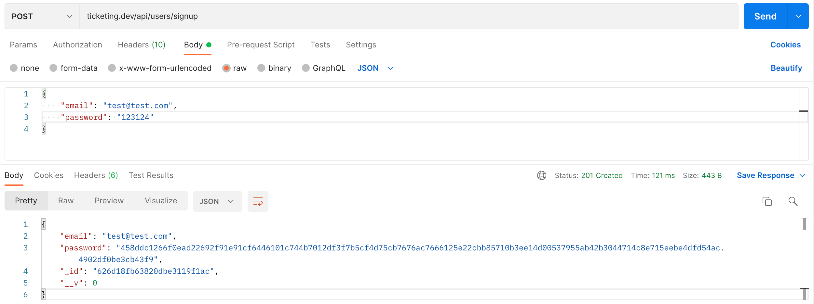
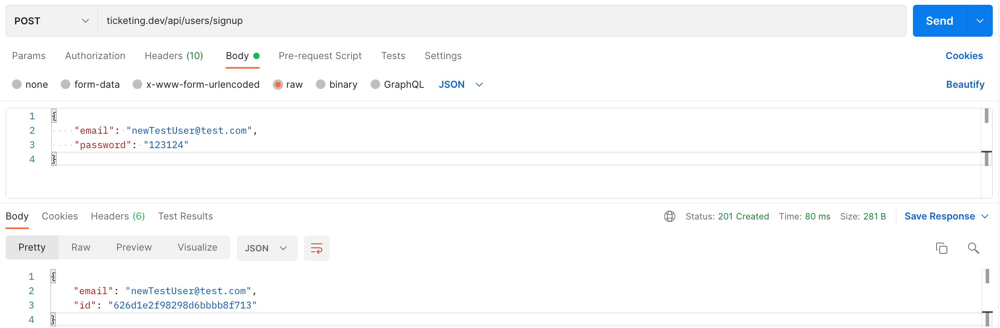

## Modifying Document Properties to JSON.stringify()

1. Try signing up a user via Postman and see the properties of a `userDoc` object. `_id` and version key `__v` are generated by Mongoose and we don't want them to appear in their current form when are JSONised and sent back to the client. In addition, we would like to remove `password` from JSONised version of a `userDoc`.

<p>

</p>

2. From the docs, in short, `'toJSON': { transform: true, flattenDecimals: true } `by default. Overwrites default objects to `toJSON()`, for determining how Mongoose documents get serialized by `JSON.stringify()`.

In `user.ts`, delete properties you don't want to appear. From MVC standpoint, we are adding view-related logic to the model-related code, so this is not the best approach, but for our purposes, it is good enough.

```ts
const userSchema = new mongoose.Schema(
  {
    email: {
      type: String,
      required: true,
    },
    password: {
      type: String,
      required: true,
    },
  },
  {
    toJSON: {
      transform: (doc, ret) => {
        ret.id = ret._id;
        delete ret._id;
        delete ret.__v;
        delete ret.password;
      },
    },
  }
);
```

3. Try signing up a new user and see how `JSON.stringify()` now works for a new user.

<p>

</p>

## Abstracting Request Validation into a Middleware

1. Abstract request validation login into `services/request-validator.ts`:

```ts
import { Request, Response, NextFunction } from "express";
import { validationResult } from "express-validator";
import { RequestValidationError } from "../errors/request-validation-error";

export const validateRequest = (
  req: Request,
  res: Response,
  next: NextFunction
) => {
  const errors = validationResult(req);

  if (!errors.isEmpty()) {
    throw new RequestValidationError(errors.array());
  }

  next();
};
```

2. Then, you can use the `validateRequest` middleware in `signup.ts` and `signin.ts`.

```ts
router.post(
  "/api/users/signin",
  [
    body("email").isEmail().withMessage("Email must be valid."),
    body("password")
      .trim()
      .notEmpty()
      .withMessage("Password must be supplied."),
  ],
  validateRequest,
  (req: Request, res: Response) => {}
);
```
