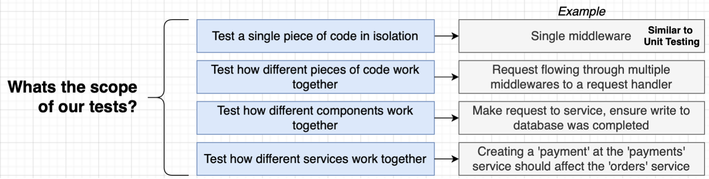
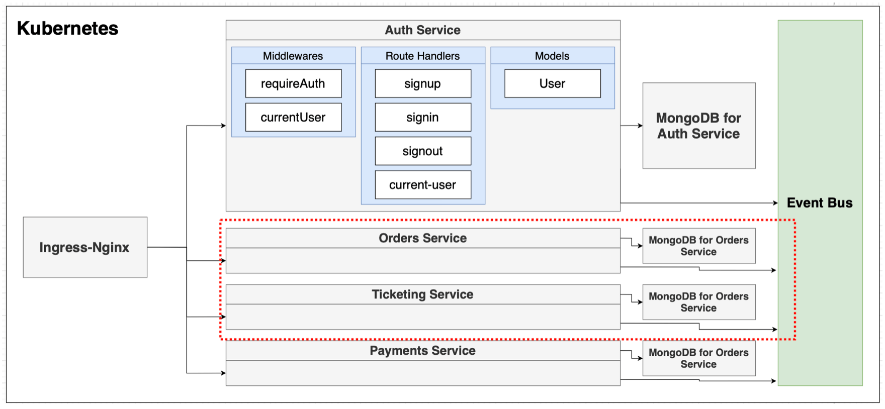
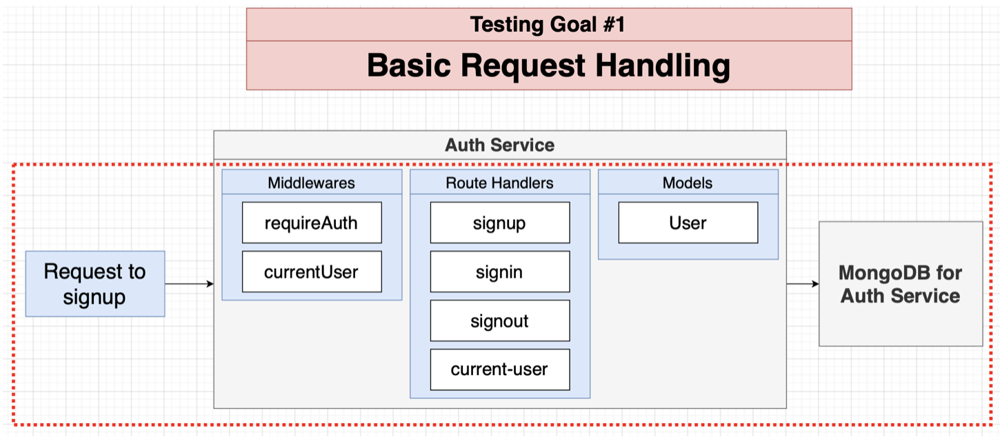
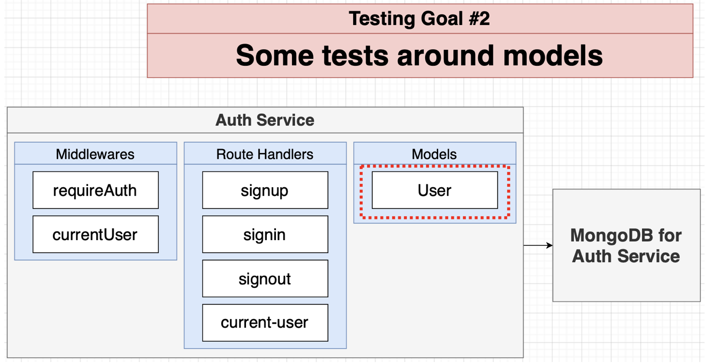
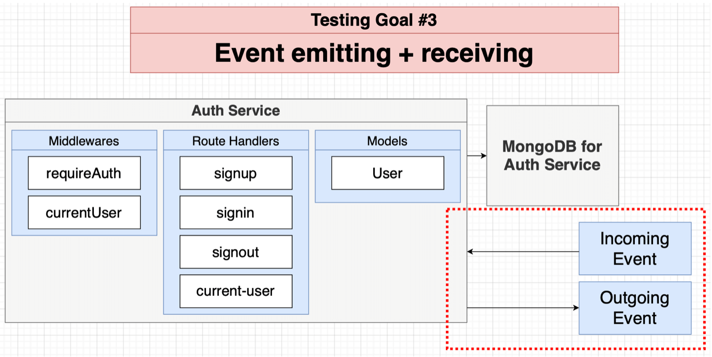

## Testing with Microservices

### Testing Scopes

In short, we have four different scopes of testing.

It can be very complex to test different services, so we need to figure out a way to create an environment in which different services run, in an easy and cost-effective way.

### Testing Goals

For now, we will focus only on **testing goal #1**.

### How to run tests?

- We are going to run these tests directly from our terminal without using Docker.

- This implies that our **local environment** is capable of running each service!

- Simple enough now, but more complex projects might make this hard.

### Testing Architecture

We will use **Jest testing framework** to implement tests. Jest will:

- Start in-memory copy of MongoDB
- Start up our Express app
- Use supertest library to make fake requests to our Express app
- Run assertions to make sure the request did the right thing

### Separating App from Index.js
