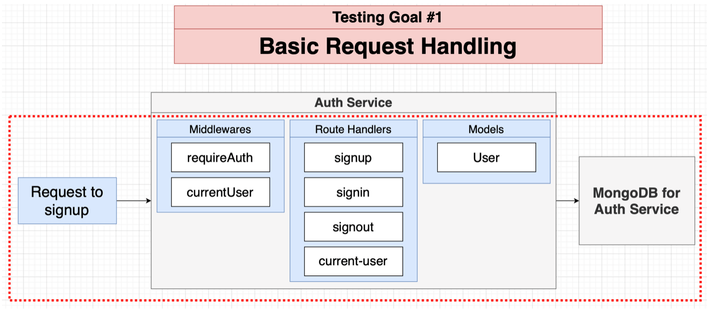
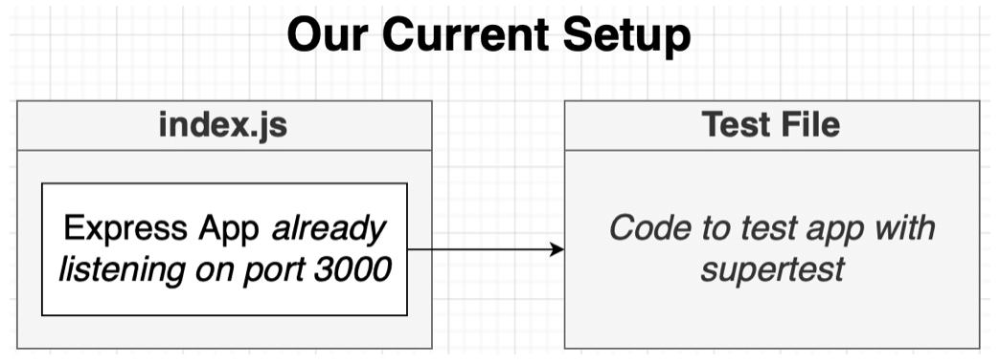
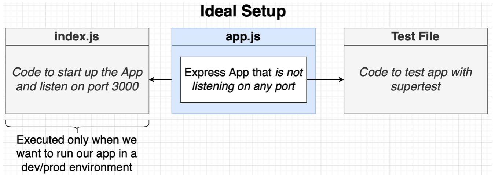
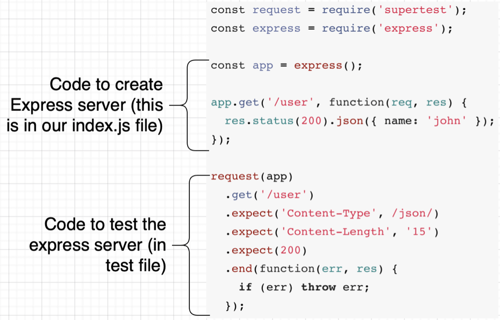

## Testing with Microservices

### Testing Scopes

In short, we have four different scopes of testing.

<p>

</p>

It can be very complex to test different services, so we need to figure out a way to create an environment in which different services run, in an easy and cost-effective way.

<p>

</p>

### Testing Goals

<p>

</p>

<p>

</p>

<p>

</p>

For now, we will focus only on **testing goal #1**.

### How to run tests?

- We are going to run these tests directly from our terminal without using Docker.

- This implies that our **local environment** is capable of running each service!

- Simple enough now, but more complex projects might make this hard.

### Testing Architecture

We will use **Jest testing framework** to implement tests. Jest will:

- Start in-memory copy of MongoDB
- Start up our Express app
- Use supertest library to make fake requests to our Express app
- Run assertions to make sure the request did the right thing

### Refactoring: Separating app.js from index.js

<p>

</p>

<p>

</p>

<p>

</p>

- **Npm supertest:** You may pass an http.Server, or a Function to request() - if the server is not already listening for connections then it is bound to an ephemeral port (random port not in use) for you so there is no need to keep track of ports.

- Turns out there are also **other benefits to using the ideal setup** (creating app but not using it or making it listen on a specific port), other than those related to testing

- To refactor, create a new file `app.ts`, cut and paste code from `index.ts`, the portion until `start` function. Import `app.ts` in `index.ts`. The new file `app.ts` will just look like:

```ts
import express from "express";
import "express-async-errors";
import cookieSession from "cookie-session";

import { CurrentUserRouter } from "./routes/current-user";
import { SignInRouter } from "./routes/signin";
import { SignOutRouter } from "./routes/signout";
import { SignUpRouter } from "./routes/signup";
import { errorHandler } from "./middlewares/error-handler";
import { NotFoundError } from "./errors/not-found-error";

const app = express();

app.set("trust proxy", true); // to make Express trust HTTPS connections from proxies
app.use(express.json());
app.use(
  cookieSession({
    signed: false, // to disable encryption of cookies
    secure: true, // to allow cookies only from HTTPS conneciton
  })
);

app.use(CurrentUserRouter);
app.use(SignInRouter);
app.use(SignOutRouter);
app.use(SignUpRouter);

app.all("*", async () => {
  throw new NotFoundError();
});

app.use(errorHandler);

export { app };
```

### Adding Jest Testing Framework

1. Install testing libraries and in-memory MongoDB, use `--save-dev` flag to avoid installing these dependencies when Docker images are built, they are only for dev purposes:

```shell
npm install --save-dev jest ts-jest supertest mongodb-memory-server @types/jest @types/supertest
```

Also update Dockerfile of `auth` service as:

```Dockerfile
FROM node:16-alpine

WORKDIR /app
COPY package.json ./
RUN npm install --only-prod
COPY ./ ./

CMD ["npm", "start"]
```

2. Add a `npm test` command inside `package.json`. Use `--watchAll` flag to watch files for changes and rerun tests related to changed files. You can also use `--no-cache` to disable test cache to fix problems of jest due to using on TS. Then, add settings about jest. First one is to make use of TS support for jest and the last one is the setup file to run before tests.

```json
  "scripts": {
    "start": "ts-node-dev --poll src/index.ts",
    "test": "jest --watchAll"
  },
  "jest": {
    "preset": "ts-jest",
    "testEnvironment": "node",
    "setupFilesAfterEnv": [
      "./src/test/setup.ts"
    ]
  },
```

3. Create the above `setup.ts` file. Before each test, we will reset the state of data by wiping the collections present in in-memory Mongo instance. Define `JWT_EKY` env variable for JWT creation logic in sign up and sign in middlewares, as it was defined only when the service runs inside a pod.

```ts
import { MongoMemoryServer } from "mongodb-memory-server";
import mongoose from "mongoose";

let mongo: any;
beforeAll(async () => {
  process.env.JWT_KEY = "someRandomString";

  mongo = await MongoMemoryServer.create();
  const mongoUri = mongo.getUri();

  await mongoose.connect(mongoUri);
});

beforeEach(async () => {
  const collections = await mongoose.connection.db.collections();

  for (let collection of collections) {
    await collection.deleteMany({});
  }
});

afterAll(async () => {
  await mongo.stop();
  await mongoose.connection.close();
});
```

### Writing Tests

1. To test some code with Jest, create a folder `__test__` in the same folder as the code you want to test, and use the `.test.ts` naming connection. For example, to test `src/routes/signup.ts`, as we will do now, create `src/routes/__test__/signup.test.ts`. Use `supertest` to instantiate server and make HTTP requests. The first test will test the **successful path**:

```ts
import request from "supertest";
import { app } from "../../app";

it("returns a 201 on successful signup", () => {
  return request(app)
    .post("/api/users/signup")
    .send({
      email: "something@example.com",
      password: "password",
    })
    .expect(201);
});
```

2. Run `npm test` and in the future in case the tests always fail even if you change and save the code, just restart the tests from CLI.

3. Write other simple tests:

```ts
it("returns a 400 on invalid email", () => {
  return request(app)
    .post("/api/users/signup")
    .send({
      email: "examplecom",
      password: "password",
    })
    .expect(400);
});

it("returns a 400 on invalid password", () => {
  return request(app)
    .post("/api/users/signup")
    .send({
      email: "something@example.com",
      password: "12",
    })
    .expect(400);
});

it("returns a 400 on missing email and passwords", async () => {
  await request(app)
    .post("/api/users/signup")
    .send({ password: "password" })
    .expect(400);

  return request(app)
    .post("/api/users/signup")
    .send({ email: "something@example.com" })
    .expect(400);
});
```

4. Write more complex tests:

```ts
it("disallows duplicate emails", async () => {
  await request(app)
    .post("/api/users/signup")
    .send({
      email: "something@example.com",
      password: "password",
    })
    .expect(201);

  return request(app)
    .post("/api/users/signup")
    .send({
      email: "something@example.com",
      password: "password",
    })
    .expect(400);
});
```
