## Integrating Next.js Client App

For the front-end application, we will be using **Next.js** to create a **server-side rendered** React application.

### Implementing the SignUp Component

1. Just like the`auth` service, create a new folder, initilize npm, install dependencies, create Docker image, Kubernetes deployment and ClusterIP objects. For the port number, use 3000 as it is the default port for Next.js.

```shell
npm init -y
npm install react react-dom next
```

In addition, add a "catch all" rule in the `ingress-srv.yaml` at the end of file:

```yaml
- path: /?(.*)
  pathType: Prefix
  backend:
    service:
      name: client-srv
      port:
        number: 3000
```

Try accessing "ticketing.dev" inside the browser, type "thisisunsafe" if you get a security warning.

2. To help solve problems with file syncing with Next.js inside a Docker container, add poll mechanism every 300 ms. In a file `client/next.config.js`:

```js
module.exports = {
  webpackDevMiddleware: (config) => {
    config.watchOptions.poll = 300;
    return config;
  },
};
```

3. We are going to add Bootstrap as a global CSS in the Next.js app, however, we can only import global CSS files inside `_app.js` component which Next.js renders for all pages, so we add a thin wrapper `_app.js` and import Bootstrap there.
   First, install Bootstrap:

```shell
npm install bootstrap
```

Then, create the wrapper `pages/_app.js`:

```js
import "bootstrap/dist/css/bootstrap.css";

export default function MyApp({ Component, pageProps }) {
  return <Component {...pageProps} />;
}
```

For more info about this issue, refer to [https://github.com/vercel/next.js/blob/canary/errors/css-global.md](https://github.com/vercel/next.js/blob/canary/errors/css-global.md)

4. Start implementing the sign up form component in `pages/auth/signup.js`, so that it can be filled at "ticketing.dev/auth/signup". First, **create the form** and make use of **`useState`** React hook for email and password values. Second, add **`onSubmit` event handler** on the form and use axios **to make a POST request**. You should see the response and saved cookie in the browser after a **successful signup**.

5. For the **unsuccessful** signup, we need to **show the related error message** inside some component. For this reason, move the POST request inside a try block and catch errors. Use another `useState` hook for errors and if their number is greater than zero, show them as a list. Up until now, the code looks like:

```js
import { useState } from "react";
import axios from "axios";

export default function signUp() {
  const [email, setEmail] = useState("");
  const [password, setPassword] = useState("");
  const [errors, setErrors] = useState([]);

  async function onSubmit(event) {
    event.preventDefault();
    try {
      const response = await axios.post("/api/users/signup", {
        email,
        password,
      });

      console.log(response.data);
    } catch (err) {
      setErrors(err.response.data.errors);
    }
  }

  return (
    <form onSubmit={onSubmit}>
      <h1>Sign Up</h1>
      <div className="form-group">
        <label>Email Address</label>
        <input
          value={email}
          onChange={(e) => setEmail(e.target.value)}
          className="form-control"
        />
      </div>
      <div className="form-group">
        <label>Password</label>
        <input
          value={password}
          onChange={(e) => setPassword(e.target.value)}
          type="password"
          className="form-control"
        />
      </div>
      {errors.length > 0 && (
        <div className="alert alert-danger">
          <h4>Ooops...</h4>
          <ul className="my-0">
            {errors.map((error) => (
              <li key={error.message}>{error.message}</li>
            ))}
          </ul>
        </div>
      )}
      <button className="btn btn-primary">Sign Up</button>
    </form>
  );
}
```

The form with both errors look like:

<p>
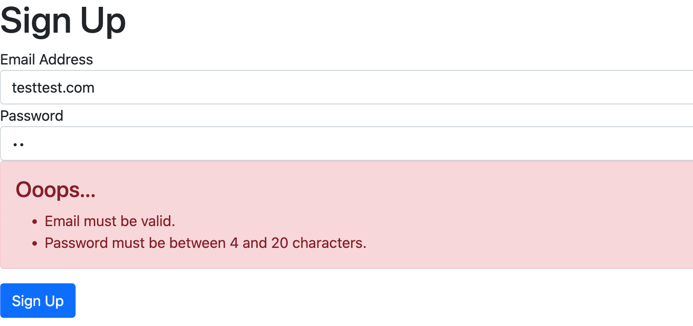
</p>

6. In the frontend app, we will be making a number of requests in the future, so it makes sense the **create our own function or hook that lets us make requests and render errors**.

<p>
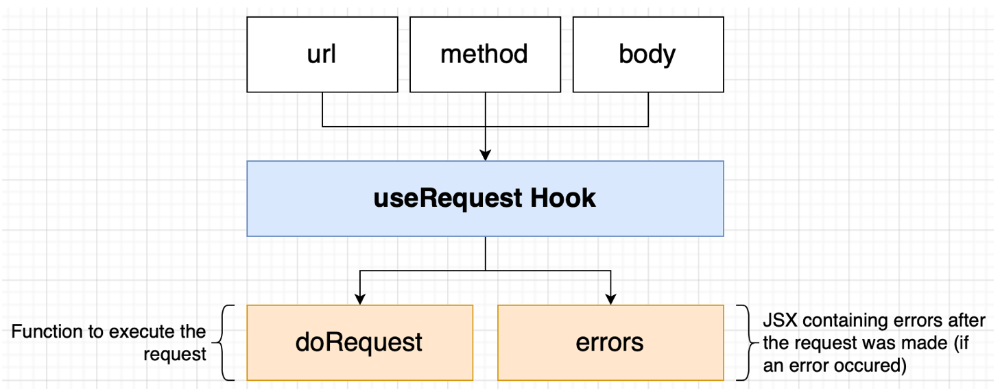
</p>

In the file `client/hooks/use-request.js`:

```js
import axios from "axios";
import { useState } from "react";

export default function useRequest({ url, method, body }) {
  const [errors, setErrors] = useState(null);

  async function doRequest() {
    try {
      setErrors(null);
      const response = await axios[method](url, body);
      return response.data;
    } catch (err) {
      setErrors(
        <div className="alert alert-danger">
          <h4>Ooops....</h4>
          <ul className="my-0">
            {err.response.data.errors.map((err) => (
              <li key={err.message}>{err.message}</li>
            ))}
          </ul>
        </div>
      );
    }
  }

  return { doRequest, errors };
}
```

Now, the sign up logic is simplified to:

```js
import { useState } from "react";
import useRequest from "../../hooks/use-request";

export default function signUp() {
  const [email, setEmail] = useState("");
  const [password, setPassword] = useState("");
  const { doRequest, errors } = useRequest({
    url: "/api/users/signup",
    method: "post",
    body: {
      email,
      password,
    },
  });

  async function onSubmit(event) {
    event.preventDefault();

    doRequest();
  }

  return (
    <form onSubmit={onSubmit}>
      <h1>Sign Up</h1>
      <div className="form-group">
        <label>Email Address</label>
        <input
          value={email}
          onChange={(e) => setEmail(e.target.value)}
          className="form-control"
        />
      </div>
      <div className="form-group">
        <label>Password</label>
        <input
          value={password}
          onChange={(e) => setPassword(e.target.value)}
          type="password"
          className="form-control"
        />
      </div>
      {errors}
      <button className="btn btn-primary">Sign Up</button>
    </form>
  );
}
```

7. Next, after a succesful sign-up, let's redirect user to the home page. For this, simply add a callback function in the `useRequest` hook to be called on success:

```js
export default function useRequest({ url, method, body, onSuccess }) {
  const [errors, setErrors] = useState(null);

  async function doRequest() {
    try {
      setErrors(null);
      const response = await axios[method](url, body);

      if (onSuccess) {
        onSuccess(response.data);
      }

      return response.data;
    catch (err) {
      ...
    }
```

and provide a callback function that redirects to home page in the `signUp` component:

```js
import Router from "next/router";

...

const { doRequest, errors } = useRequest({
  url: "/api/users/signup",
  method: "post",
  body: {
    email,
    password,
  },
  onSuccess: () => Router.push("/"),
});
```

### Fetching Sign In Data During SSR

1. To check whether the user is already signed in, we need to make a GET request to `/api/users/currentuser`. However, the components are rendered on the server side and we need to make the request before the full page is rendered.

<p>
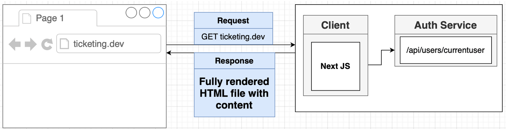
</p>

We cannot make the request from inside the browser, but `getInitialProps` function lets us make requests before components are rendered.

<p>
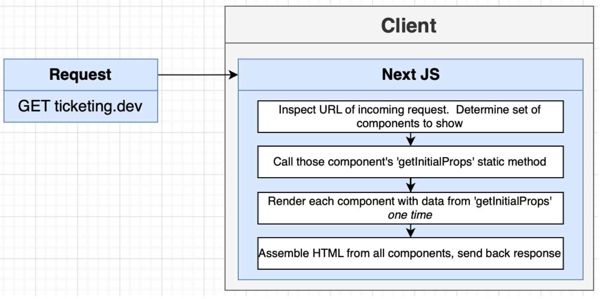
</p>

In `index.js`:

```js
import axios from "axios";

const homePage = ({ currentUser }) => {
  console.log(currentUser);
  return <h1>Home Page!</h1>;
};

homePage.getInitialProps = async () => {
  const response = await axios.get("/api/users/currentuser");

  return response.data;
};

export default homePage;
```

2. Try accessing the home page in the browser, you should the `Error: connect ECONNREFUSED 127.0.0.1:80` error. This happens because we are making the GET request **from inside the `client` container** and it does not goes to Ingress-Nginx for it to transfer the request to the `auth` service. If we made the request from inside the browser like below, getting the data after SSR render in the browser, it would have worked.

<p>
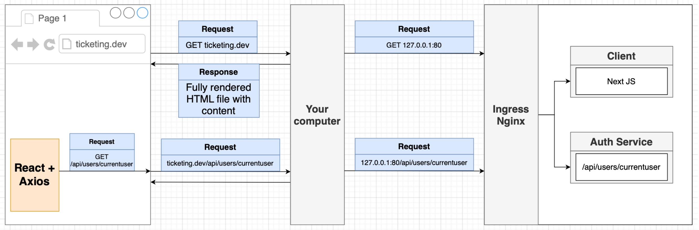
</p>

On the other hand, our setup looks like this:

<p>
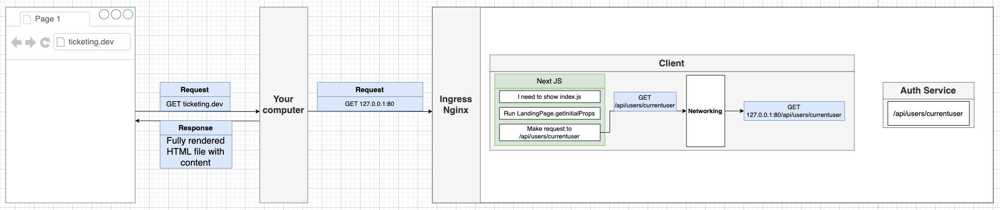
</p>

Because the domain is not automatically specified as "ticketing.dev" like the browser did, NodeJS http layer added localhost automatically. However, **this 127.0.0.1 is not the localhost of your computer**, **it is the localhost inside the K8s container**, and there is no one listening on port 80 on that container.

3. To solve this issue, we slighty modify `axios` to add domains to the request depending on the environment the request is made. Specifically, we **add domain prefix if the request is made from the server-side**, as for the client-side, the browser automatically does that for us.

<p>
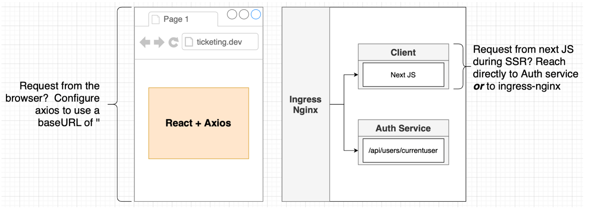
</p>

We can either make the request directly to the `auth` service in this case, or as we will do now, **implement the general case and make the request to the Ingress-Nginx**. We also need to manually transfer the cookie when we make request to back-end services.

<p>
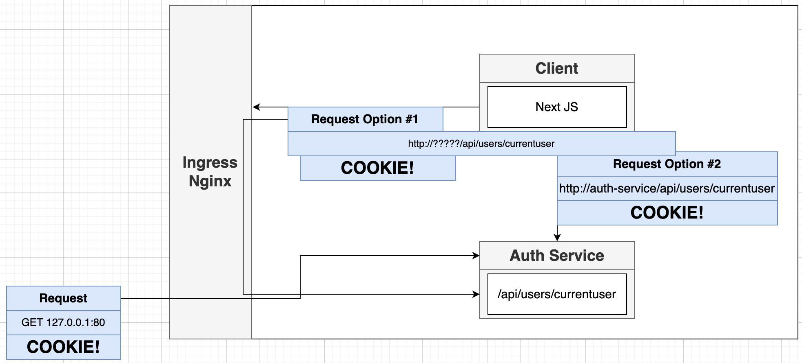
</p>

### Making Requests to a Service in another Namespace

1. We can access services using the `http://auth-srv` style only when they are in the same namespace.

<p>
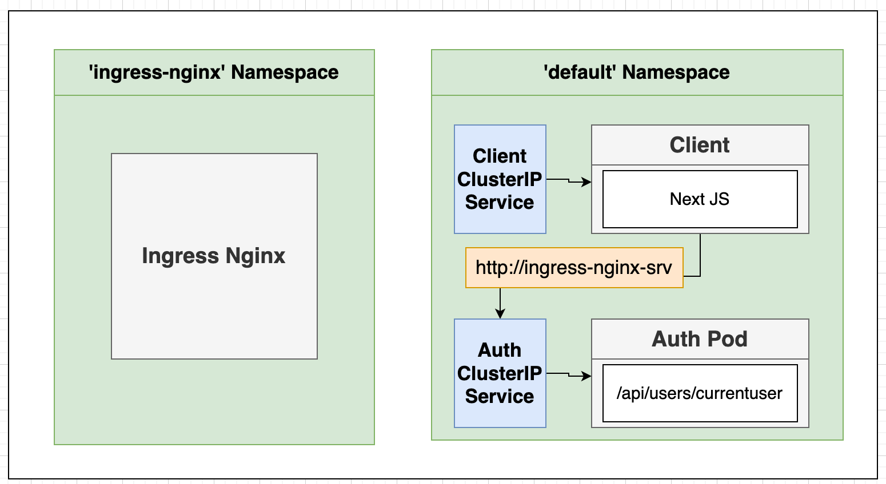
</p>

2. However, cross-namespace communication uses the pattern `<service-name>.<namespace-name>.svc.cluster.local/api/...`. To get the name of the service we need to access, do a `kubectl get services -n ingress-nginx`. The name of the service we need to access is `ingress-nginx-controller`.

<p>
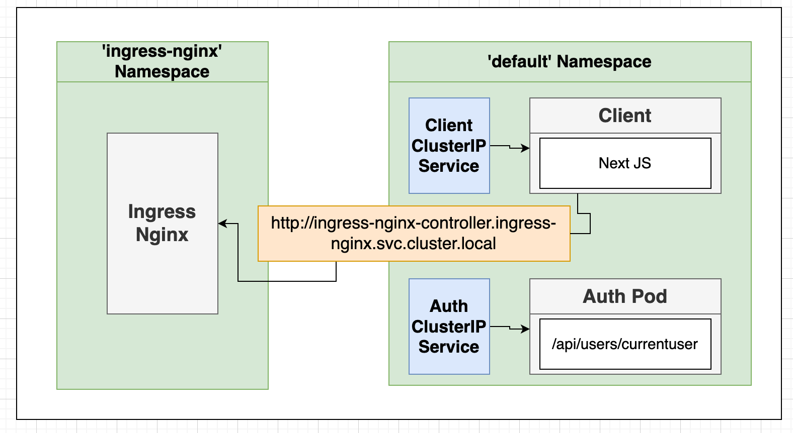
</p>

3. We can also create a **External Name Service** to shorten the URL, but we are **not** going to do that to keep things simple.

<p>
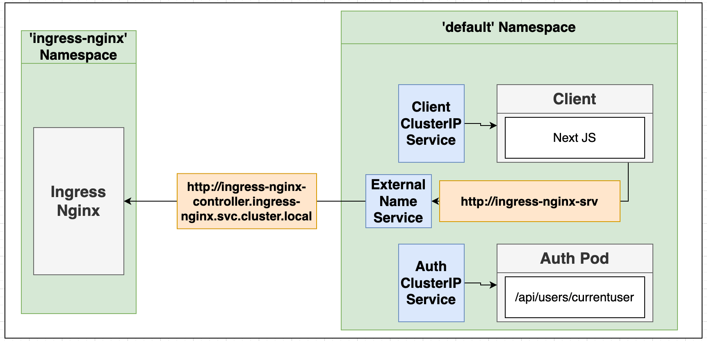
</p>

### When does getInitialProps get called?

1. We know that we cannot fetch data inside React components while they are being rendered on the server side, because we would **not have time to wait for the request to resolve and change state during SSR**. So, getInitialProps is our opportunity to fetch data during rendering process. However, there are also **some particular scenarios when it gets called on the client-side**.

<p>
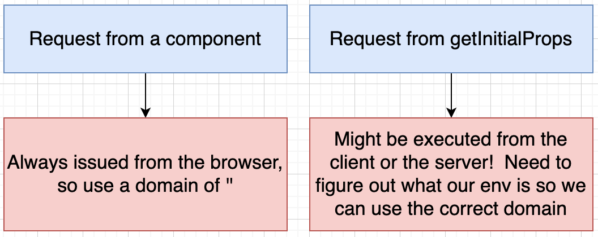
</p>

`getInitialProp` gets called on the client-side such as when we transition to the home page after successful sign-up, using `Router.push('/')`.

<p>
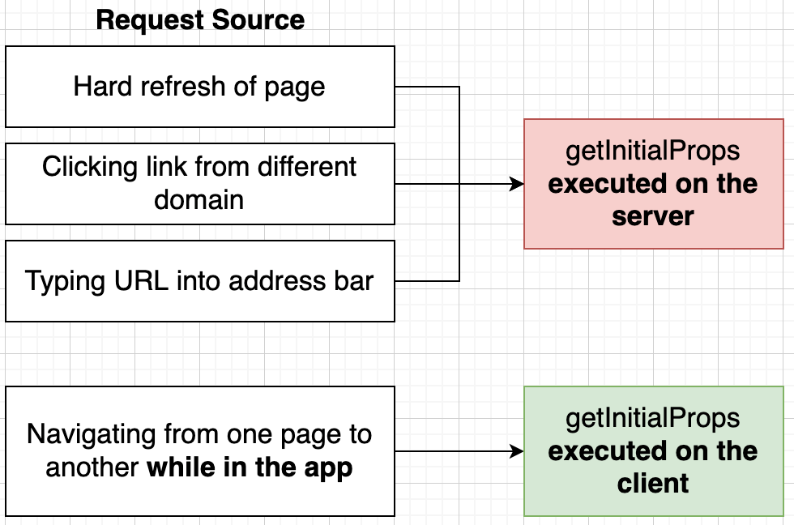
</p>

2. We can use a little silly method to figure out whether we are on the server or inside a browser. In addition, unlike the browser automatically specifying the host, we need to specify it manually to make the request from inside the server-side.

```js
import axios from "axios";

const homePage = ({ currentUser }) => {
  console.log(currentUser);
  return <h1>Home Page!</h1>;
};

homePage.getInitialProps = async () => {
  if (typeof window === "undefined") {
    // we are on the server
    const response = await axios.get(
      "http://ingress-nginx-controller.ingress-nginx.svc.cluster.local/api/users/currentuser",
      {
        headers: {
          Host: "ticketing.dev",
        },
      }
    );
    return response.data;
  } else {
    // we are inside the browser
    const response = await axios.get("/api/users/currentuser");
    return response.data;
  }
};

export default homePage;
```

Try to make the request by hard-refreshing the homepage, the `getInitialProps` will be called from server-side, but because we did not include the cookie unlike the browser automatically, the current user will be returned as `null`.

3. We know that the request from the browser first visits `client` service, then we transfer the request to `auth` service to check whether the user is signed in. When the `getInitialProps` is called on the server-side, it is in fact provided with the `request` object, let's print the headers of the request from the client:

```js
homePage.getInitialProps = async ({ req }) => {
  console.log(req.headers);
...
}
```

<p>
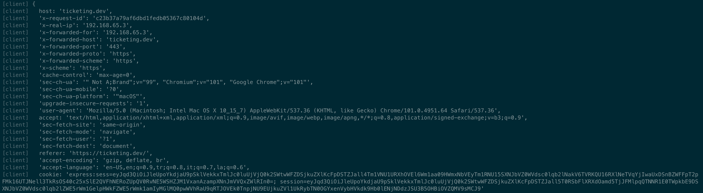
</p>

We can in fact both use the `host` and `cookie` headers when we do another request to the `auth` service. Another way is to simple copy all the headers to the next request, so that `client` service acts similar to a proxy to the `auth` service.

```js
homePage.getInitialProps = async ({ req }) => {
  r;
  if (typeof window === "undefined") {
    // we are on the server
    const response = await axios.get(
      "http://ingress-nginx-controller.ingress-nginx.svc.cluster.local/api/users/currentuser",
      {
        headers: req.headers,
      }
    );
    return response.data;
  } else {
    // we are inside the browser
    const response = await axios.get("/api/users/currentuser");
    return response.data;
  }
};
```

4. The above code works, but we don't want to write all this code whenever we want to make a request from inside the server, so we abstract the code into a custom HTTP client. In `client/api/build-client.js`:

```js
import axios from "axios";

export default async function buildClient({ req }) {
  if (typeof window === "undefined") {
    return axios.create({
      baseURL:
        "http://ingress-nginx-controller.ingress-nginx.svc.cluster.local",
      headers: req.headers,
    });
  } else {
    return axios;
  }
}
```

Now, `index.js` simplifies to:

```js
import buildClient from "../api/build-client";

const homePage = ({ currentUser }) => {
  console.log(currentUser);
  return <h1>Home Page!</h1>;
};

homePage.getInitialProps = async (context) => {
  const response = await (
    await buildClient(context)
  ).get("/api/users/currentuser");

  return response.data;
};

export default homePage;
```

5. Display whether the user is signed in a very simple way for now as:

```js
const homePage = ({ currentUser }) => {
  return currentUser ? (
    <h1>You are signed in!</h1>
  ) : (
    <h1>You are NOT signed in!</h1>
  );
};
```

6. Create sign in form by basically creating a new page and React component by simply copy-pasting the same code from sign-up component. Change the request address and form labels.

### Creating A Resuable Sign Up/In Header

1. Now we create a reusable header that is placed in all pages. The header needs to have to `currentUser` info, so it makes sense to make the `currentUser` in the most top `_app.js` page that is rendered for all pages.

<p>
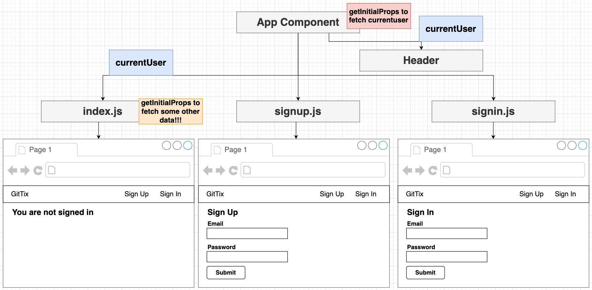
</p>

2. Let's try to make the call in `getInitialProps` of main Next.js app component `AppComponent`:

```js
import "bootstrap/dist/css/bootstrap.css";
import buildClient from "../api/build-client";

export default function AppComponent({ Component, pageProps }) {
  return <Component {...pageProps} />;
}

AppComponent.getInitialProps = async (appContext) => {
  const response = await (
    await buildClient(appContext.ctx)
  ) // how you get context in main app components in Next.js
    .get("/api/users/currentuser");

  console.log(response.data);
  return response.data;
};
```

Try accessing the homepage on the browser, you should see "NOT signed in" even if your browser has a valid cookie. The reason is that **`getInitialProps` of page components do not get called when we define a `getInitialProps` on the main app component of Next.js.** This is just some weird part of Next.js.

3. The solution we make is that we will call the `getInitialProps` of `homePage` component, or any component if it has a `getInitialProps` defined (eg. `signup` and `signin` components do not have `getInitialProps`),inside the `getInitialProps` of `AppComponent`.

```js
AppComponent.getInitialProps = async (appContext) => {
  const response = await (
    await buildClient(appContext.ctx)
  ) // how you get context in main app components in Next.js
    .get("/api/users/currentuser");

  let pageProps = {};

  if (appContext.Component.getInitialProps) {
    pageProps = await appContext.Component.getInitialProps(appContext.ctx);
  }

  return response.data;
};
```

4. Now, pass the page props below:

```js
export default function AppComponent({ Component, pageProps, currentUser }) {
  return (
    <div>
      <h1>Hi {currentUser.email}</h1>
      <Component {...pageProps} />
    </div>
  );
}

AppComponent.getInitialProps = async (appContext) => {
  const response = await (
    await buildClient(appContext.ctx)
  ) // how you get context in main app components in Next.js
    .get("/api/users/currentuser");

  let pageProps = {};

  if (appContext.Component.getInitialProps) {
    pageProps = await appContext.Component.getInitialProps(appContext.ctx);
  }

  return { pageProps, currentUser: response.data.currentUser };
};
```

5. Create the actual `Header` component in `components/header.js`. Add sign up, sign in and sign out buttons, conditionally display them depending on the `currentUser`:

```js
import Link from "next/link";

export default function Header({ currentUser }) {
  const links = [
    !currentUser && { label: "Sign Up", href: "/auth/signup" },
    !currentUser && { label: "Sign In", href: "/auth/signin" },
    currentUser && { label: "Sign Out", href: "/auth/signout" },
  ]
    .filter((link) => link)
    .map(({ label, href }) => {
      return (
        <li key={href} className="nav-item">
          <Link href={href}>
            <a className="nav-link">{label}</a>
          </Link>
        </li>
      );
    });

  return (
    <nav className="navbar navbar-light bg-light">
      <Link href={"/"}>
        <a className="navbar-brand">GitTix</a>
      </Link>

      <div className="d-flex justify-content-end">
        <ul className="nav d-flex align-items-center">{links}</ul>
      </div>
    </nav>
  );
}
```

Use it inside the main component:

```js
<div>
  <Header currentUser={currentUser} />
  <Component {...pageProps} />
</div>
```

6. Finally, add the signout page as `auth/signout.js`, make use of `useEffect` hook to make the request one time in the browser :

```js
import { useEffect } from "react";
import useRequest from "../../hooks/use-request";
import Router from "next/router";

export default function signOut() {
  const { doRequest } = useRequest({
    url: "/api/users/signout",
    method: "post",
    body: {},
    onSuccess: () => Router.push("/"),
  });

  useEffect(() => {
    doRequest();
  }, []);

  return <div>Signing you out...</div>;
}
```

7. The client app now looks like below with working authentication logic and it just be fine for now for our purposes.

Home Page looks like:

<p>
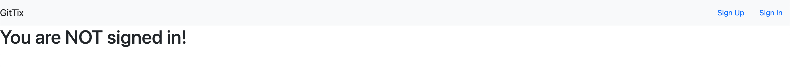
</p>

Sign in form looks like:

<p>
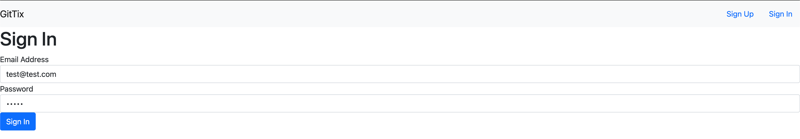
</p>

Home page after user signed in looks like:

<p>
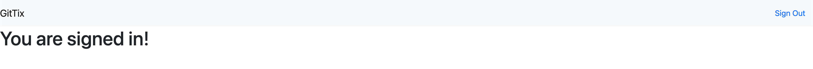
</p>
