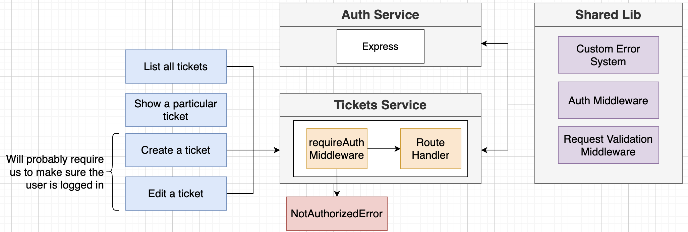

## Why Do We Share Logic?

It turns out that a lot of the logic we need for the `tickets` service is already implemented in the `auth` service. Even if this might be an example of **microservices anti-patterns**, we will share some of the logic via **NPM registry**.

<p>

</p>

1. We start with creating a public organization in NPM website. Go to [npmjs.com](https://www.npmjs.com/) and create a new organization.

2. Inside the project folder `ticketing`, create a new folder named `common`. Initilize npm and specify name of the npm package with your organization name such as:

```json
{
  "name": "@oetickets/common",
  "version": "1.0.0",
  "description": "",
  "main": "index.js",
  "scripts": { "test": "echo \"Error: no test specified\" && exit 1" },
  "keywords": [],
  "author": "",
  "license": "ISC"
}
```

The `name` index inside `package.json` specifies the organization and package name we want to publish the code.

3. For us to publish it, we need to initialize git (not necessarily connected to remote GitHub) inside the folder and commit all changes. Initilize git, add changes, commit and after them:

```shell
npm login
npm publish --access public
```

Npm publishes packages as private packages by default, which requires paying money, so we need the above flag not to get errors.

4. In the future, there might be differences in our TS settings between the `common` library and other services, we wouldn't want to deal with that. In addition, some of the services might not be written in TS at all. For these reasons, **we will write the common library as TS but publish as JS.** Inside `common` folder:

```shell
tsc --init
npm i typescript del-cli --save-dev
```

5. In `package.json` include a script tag `build: "tsc"` to run tsc compiler. Also change below settings in `tsconfig.json`. The first one specifies an output folder for all emitted files while the second one generates `.d.ts` files from TS and JS files in the project.

```json
    "outDir": "./build",
    "declaration": true,
```

6. Write some very simple TS code in `src/index.ts` and try converting it into JS by `npm run build`. Expect JS code and `index.d.ts` type definition file inside `build` folder. To have clean build each time, delete previous build by adding a `clean` script inside `build` tag.

7. Change `main` and add `types` and `files` tags inside `package.json`. The first refers to the main file used during import by other files, the second specifies type definition file and the third specifies what files we want to publish to NPM registry. Add a `.gitignore` and add `node_modules` and `build` directories to it. `package.json` now looks like:

```json
{
  "name": "@oetickets/common",
  "version": "1.0.0",
  "description": "",
  "main": "./build/index.js",
  "types": "./build/index.d.ts",
  "files": ["build/**/*"],
  "scripts": {
    "clean": "del ./build/*",
    "build": "npm run clean && tsc"
  },
  "keywords": [],
  "author": "",
  "license": "ISC",
  "devDependencies": {
    "del-cli": "^4.0.1",
    "typescript": "^4.6.4"
  }
}
```

8. When you make a change to the package and want to publish it, what you would do in general is, you first commit changes, then update version number, **ideally according to semantic versioning**, build the package and publish it to NPM registry. In the context of this project, because we would do frequent changes to the common package, we add a script as:

```json
  "scripts": {
    "clean": "del ./build/*",
    "build": "npm run clean && tsc",
    "pub": "git add . && git commit -m \"Updates\" && npm version patch && npm run build && npm publish"
  },
```

**Do not do this in a real project** as you should see the changes yourself, change version number according to the extent of changes and add specific commit messages.

## Relocating Code from Auth Service to Common Package

1. We will be using code in `errors` and `middlewares` also in other services. So, simply copy-paste them from `auth` service to `common/src`.

2. To be able to import logic in other services without specifying exact location of the file inside the package, we export the code we want to share inside `index.ts`:

```ts
export * from "./errors/bad-request-error";
export * from "./errors/custom-error";
export * from "./errors/db-connection-error";
export * from "./errors/not-authorized-error";
export * from "./errors/not-found-error";
export * from "./errors/request-validation-error";

export * from "./middlewares/current-user";
export * from "./middlewares/error-handler";
export * from "./middlewares/request-validator";
export * from "./middlewares/require-auth";
```

3. When we try building the package now, it would give errors because we don't have dependencies installed in this package. Take a look at dependencies and install them:

```shell
npm install express express-validator cookie-session jsonwebtoken @types/express @types/cookie-session @types/jsonwebtoken
```

4. Now publish the code by running our "shortcut" script:

```shell
npm run pub
```

## Updating Import Statements

1. Let's update the import statements in `auth` service to use our package `@oetickets/common`. First install our package in the `auth` service:

```shell
npm install @oetickets/common
```

2. Search for what files need updating and fix them, such as:

```ts
import { validateRequest, BadRequestError } from "@oetickets/common";
```

3. Do a `skaffold dev` to run the project and make sure it works.

## Updating Common Module

1. When you add new logic to the `@oetickets/common` package, we will publish it and do a `npm update @oetickets/common` in services that use it.

2. If you want to verify that the services use the latest version in somewhat tedious way, compare the version number of `common` inside running pod with your version in the NPM registry:

```shell
kubectl get pods
kubectl exec -it auth-depl-5ff7978dbd-x4zlk sh
cd node_modules/@oetickets/common
cat package.json
```
