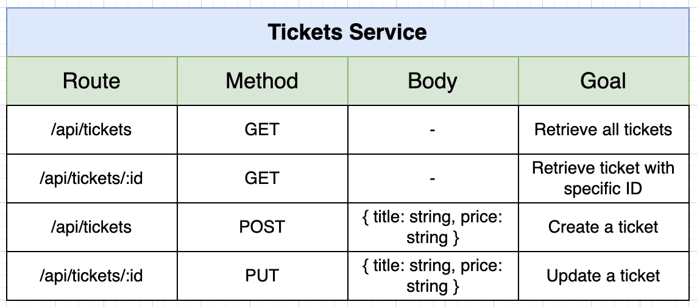

## Setting Up Tickets Service

Let's start implementing our second business-logic service `tickets` that deal with simple CRUD operations related to tickets.

<p>

</p>

1. To save us some time, copy-paste all Dockerfile and package.json-ish files from `auth` service to a new `tickets` folder. Also copy `test`, `app.ts` and `index.ts` from `src` of `auth` service.

2. Do a `npm install` inside `tickets`. Create Docker image and push to Dockerhub. Create K8s deployment and ClusterIP services for `tickets` and `tickets-mongo` services and update`skaffold.yaml` as well.

3. Leave out `JWT_KEY` environment variable since the we decided to **do autherization inside individual services**, so it will try to read the contents of a valid `currentUser` cookie.

4. To not have connection strings to mongo instances hardcoded in code, let's have them as env variables. Modify `tickets` K8s deployment file to have:

```yaml
env:
  - name: MONGO_URI
    value: "mongodb://tickets-mongo-srv:27017/tickets"
```

We wrote the connection string as plain text since connecting to the DB did not require username and password in this case. Otherwise, we would create a K8s secret and share username and password via secrets. Change connection statement in `tickets` into:

```ts
if (!process.env.MONGO_URI) {
  throw new Error("MONGO_URI must be defined");
}

try {
  await mongoose.connect(process.env.MONGO_URI);
} catch (err) {
  console.error(err);
}
```

Do similar changes for `auth` service as well.

## Applying Test-Driven-Development

For the development process of `tickets` service, let's utilize TDD.

1. Inside `src/routes/__test__`, create test file `create-ticket.test.ts` which will test `create-ticket.ts` router. Let's define some test:

```ts
import request from "supertest";
import { app } from "../../app";

it("has a route handler listening to /api/tickets for post requests", async () => {});

it("cannot be accessed if the user is not signed in", async () => {});

it("can only be accessed if the user is signed in", async () => {});

it("returns an error if an invalid title is provided", async () => {});

it("returns an error if an invalid price is provided", async () => {});

it("creates a ticket with valid inputs", async () => {});
```

2. For the very first test, we just want from `tickets` service to actually have a route handler for POST requests to`/api/tickets`. In the second test, we expect to have 401 status code which is for authorization errors. Implement the router for these two tests.

```ts
it("has a route handler listening to /api/tickets for post requests", async () => {
  const response = await request(app).post("/api/tickets").send({});

  expect(response.statusCode).not.toEqual(404);
});

it("cannot be accessed if the user is not signed in", async () => {
  await request(app).post("/api/tickets").send({}).expect(401);
});
```

3. Next, we check whether users with valid cookie can access the service.

```ts
it("can only be accessed if the user is signed in", async () => {
  const cookie = signupCookie();

  const response = await request(app)
    .post("/api/tickets")
    .set("Cookie", cookie)
    .send({});

  expect(response.statusCode).not.toEqual(401);
});
```

To test the `ticketing` service, we should not need to make requests to `auth` service or any other service. Therefore, in order to have a valid cookie, we will generate our own one. Add a helper function similar to the one we used for `currentUser` test. Generate a valid cookie in `test/authHelper.ts`:

```ts
import jwt from "jsonwebtoken";

const signupCookie = () => {
  // Build a JWT payload
  const payload = {
    id: "123123",
    email: "test@example.com",
  };

  // Create the JWT
  const token = jwt.sign(payload, process.env.JWT_KEY!);

  // Build session object
  const session = {
    jwt: token,
  };

  // Turn that session into JSON
  const sessionJson = JSON.stringify(session);

  // Take JSON and encode as Base64
  const encodedString = Buffer.from(sessionJson).toString("base64");

  // Return a string that is the cookie with the encoded data
  return [`session=${encodedString};`];
};

export { signupCookie };
```

4. **Implementation note for the third test:** To be able to decode the cookie, the `app.ts` of `tickets` service can utilize `currentUser` middleware we put inside our `@oetickets/common` package. It will decode the token into a `UserPayload`. Then, you can add `requireAuth` middleware from `common` package inside route handlers that you think requires authorization, such as creating a ticket like in this case.`requireAuth` middleware will throw `NotAuthorizedError` in cases where the request does not have a decoded and valid `UserPayload` as `currentUser` property of `Request` object.

5. Let's add two tests about the attributes needed to create a ticket. Don't forget to add a valid JWT inside cookies to pass the authorization step. You can use `express-validator` and our `validateRequest` middleware to add neceessary validation rules to the route handler. Add them after `requireAuth` middleware so that the handler **fails fast**.

```ts
it("returns an error if an invalid title is provided", async () => {
  const cookie = signupCookie();

  await request(app)
    .post("/api/tickets")
    .set("Cookie", cookie)
    .send({
      price: 100,
    })
    .expect(400);

  await request(app)
    .post("/api/tickets")
    .set("Cookie", cookie)
    .send({
      title: "",
      price: 100,
    })
    .expect(400);
});

it("returns an error if an invalid price is provided", async () => {
  const cookie = signupCookie();

  await request(app)
    .post("/api/tickets")
    .set("Cookie", cookie)
    .send({
      title: "valid title",
    })
    .expect(400);

  await request(app)
    .post("/api/tickets")
    .set("Cookie", cookie)
    .send({
      title: "valid title",
      price: -10,
    })
    .expect(400);
});
```

6. To test the creation of a ticket inside Mongo, or Mongo-memory-server as in this case, create a valid request and check whether the number of documents are incremented by one, or check actual properties of the created document. To implement this, add `src/models/Ticket.ts` to model it similar to a user model we prepared for the `auth` service. **Associate created tickets with their creator users using `req.currentUser.id`.**

```ts
it("creates a ticket with valid inputs", async () => {
  const cookie = signupCookie();

  let tickets = await Ticket.find({});
  expect(tickets.length).toEqual(0);

  const price = 100;

  await request(app)
    .post("/api/tickets")
    .set("Cookie", cookie)
    .send({
      title: "valid title",
      price: price,
    })
    .expect(201);

  tickets = await Ticket.find({});
  expect(tickets.length).toEqual(1);
  expect(tickets[0].price).toEqual(price);
});
```
