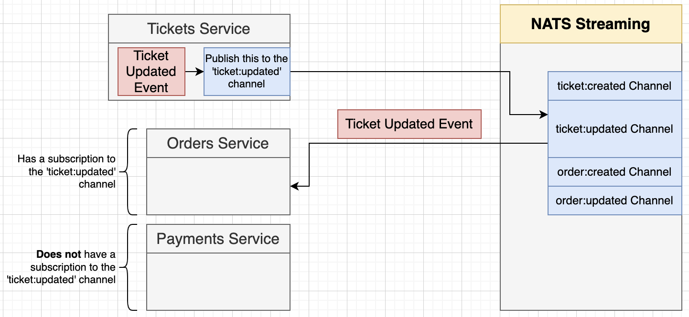

## Introduction to NATS

Software applications and services need to exchange data. NATS is an infrastructure, maintained by CNCF, that allows such data exchange, segmented in the form of messages, in other words, a **message oriented middleware**.
With NATS, application developers can:

- Effortlessly build distributed and scalable client-server applications.
- Store and distribute data in realtime in a general manner. This can flexibly be achieved across various environments, languages, cloud providers and on-premises systems.
  For more info, refer to [official docs](https://docs.nats.io).

**Important note:** The implementation we will be using is the **NATS Streaming Server**, aka STAN, which is built on top of core NATS. For more info, refer to [official docs of STAN](https://docs.nats.io/legacy/stan/intro).

**Update:** STAN is being deprecated by June 2023, to be replaced by JetStream, however, for the purpose of our project, STAN will be more than okay.

## Setting Up NATS Streaming Server

1. The Docker image we will be utilizing is `nats-streaming`. Let's add its K8s config file and create a deployment and ClusterIP service. In `infra/k8s/nats-depl.yaml`:

```yaml
apiVersion: apps/v1
kind: Deployment
metadata:
  name: nats-depl
spec:
  replicas: 1
  selector:
    matchLabels:
      app: nats
  template:
    metadata:
      labels:
        app: nats
    spec:
      containers:
        - name: nats
          image: nats-streaming # I used latest rather than 0.17.0
          args: [
              "-p", # Use port for clients
              "4222",
              "-m", # Use port for http monitoring
              "8222",
              "-hbi", # Interval at which server sends heartbeat to a client
              "5s",
              "-hbt", # How long server waits for a heartbeat response
              "5s",
              "-hbf", # Number of failed heartbeats before server closes the client connection
              "2",
              "-SD", # Enable STAN debugging output
              "-cid", #Cluster ID (default: test-cluster)
              "ticketing",
            ]
---
apiVersion: v1
kind: Service
metadata:
  name: nats-srv
spec:
  selector:
    app: nats
  ports:
    - name: client
      protocol: TCP
      port: 4222
      targetPort: 4222
    - name: monitoring
      protocol: TCP
      port: 8222
      targetPort: 8222
```

2. To connect with Node.js instances, we will use `node-nats-streaming`, which is [Node.js client for NATS streaming server.](https://www.npmjs.com/package/node-nats-streaming) Communication model in fact **Publish/Subscribe** pattern and NATS also offers storing event in memory, flat file or in a MySQL/PostgreSQL instance.

- NATS Streaming requires us to subscribe to **channels (aka topics)**. Events are emitted to specific channels.

<p> 

</p>

- NATS Streaming **stores all events** in memory (default), flat files or in a MySQL/Postgres DB.

<p>

</p>
